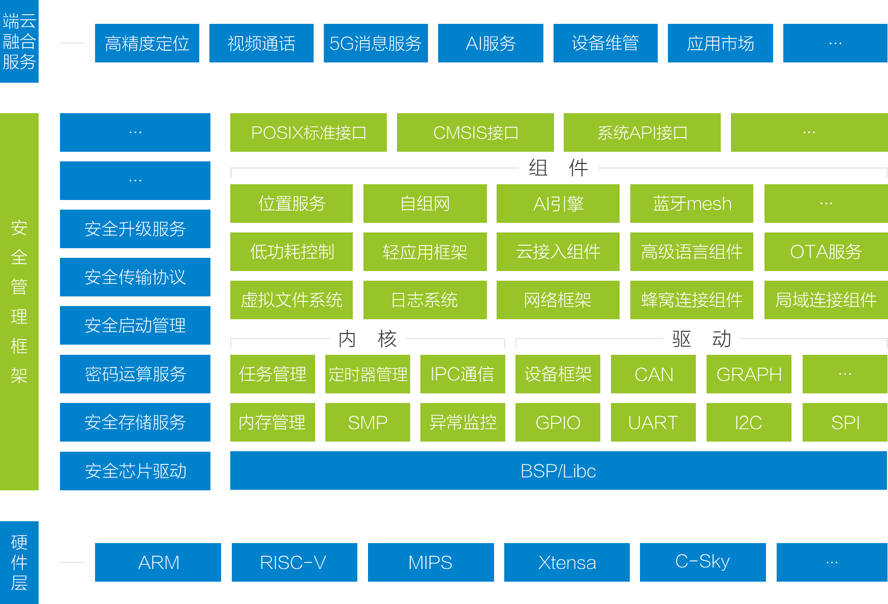

# OneOS概述

OneOS是中国移动针对物联网领域推出的轻量级操作系统，具有可裁剪、跨平台、低功耗、高安全等特点，支持ARM Cortex-A和 Cortex-M、MIPS、RISC-V等主流芯片架构，兼容POSIX、CMSIS等标准接口，支持Javascript、MicroPython等高级语言开发模式，提供图形化开发工具，能够有效提升开发效率、降低开发成本，帮助用户快速开发稳定可靠、安全易用的物联网应用。

## OneOS架构

OneOS总体架构采用分层设计，主体由驱动、内核、组件、安全框架组成。采用一个轻量级内核加多个系统组件的模式，加上海量硬件的适配支持，使OneOS具备极高的可伸缩性与易用性。操作系统整体架构如下图：

### 内核

极简的设计思路，在减少资源开销的情况下兼具优秀的实时响应特征，支持多任务管理调度，提供丰富的IPC策略，如信号量、互斥量、消息队列、邮箱等，提供了高效可靠的RTOS内核支撑。

### 驱动
提供丰富的BSP板级支撑，适配超千款MCU，支持ARM、RISC-V、MIPS、Xtensa、C-Sky等主流架构，通过抽象设计，将所有外设以设备方式进行管理，极大提升了应用开发的便利性。

### 组件

提供包括网络协议、云平台接入、远程升级、文件系统、日志系统、测试框架、调试工具等众多通用服务能力，也包括高精度定位等专业应用领域的完整解决方案。由于采用了模块化的设计，因此各个组件相互独立，耦合性低，易于灵活裁剪。

### 安全管理框架

终端侧基于信任根实现轻量级的主动检测和可信度量，提供轻量级的密码算法库及轻量级密钥管理与密钥协商机制，实现端到端安全通信。平台侧基于大数据态势感知技术，帮助用户建立端侧安全画像，根据应用场景制定不同的安全管理策略。

## OneOS特点

### 灵活裁剪

抢占式的实时多任务RTOS内核，支持多任务处理、软件定时器、信号量、互斥锁、消息队列、邮箱和实时调度等特性，RAM和ROM资源占用极小。可灵活裁剪，搭配丰富组件，适应不同客户需求。

### 跨芯片平台

应用程序可无缝移植，大幅提高软件复用率。支持的主流芯片架构有：ARM Cortex-A和Cortex-M、MIPS、RISC-V等。支持几乎所有的MCU和主流的NB-IOT、4G、WIFI、蓝牙通信芯片。

### 组件丰富

提供丰富的组件功能，如互联互通、端云融合、远程升级、室内外定位、低功耗控制等。同时提供开放的第三方组件管理工具，支持添加各类第三方组件，以便扩展系统功能。

### 易于开发

一站式开发工具OneOS Studio可用于对内核和组件的功能进行配置，支持组件自由裁剪，让系统按需进行积木式构建，同时可帮助用户跟踪调试，快速定位问题。

### 低功耗设计

支持MCU和外围设备的功耗管理，用户可以根据业务场景选择相应低功耗方案，系统会自动采用相应功耗控制策略，进行休眠和调频调压，有效降低设备整体功耗。

### 安全设计

针对物联网设备资源受限、海量连接、网络异构等特点，参考等保2.0及《GB/T 36951-2018 信息安全技术 物联网感知终端应用安全技术要求》等规范，在系统安全、通信安全、数据安全等方面提供多维度安全防护能力。

### OpenCPU开发框架

支持通信SoC芯片OpenCPU开发模式，为开发者带来屏蔽复杂通信芯片差异的高效开发方式，提供统一开发体验。同时，在同样的业务功能下，减少了设备额外MCU开销和存储器的使用，大幅降低设备成本。

## 许可协议

OneOS 代码遵循 Apache 2.0 license 开源协议。

