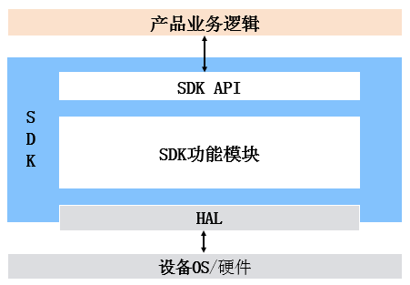

# Aliiotkit第三方组件设计文档

## 简介

Aliiotkit-v3.1.0是OneOS操作系统移植的用于连接阿里云平台的第三方组件，适用于使用C语言开发产品业务处理逻辑的设备接入阿里云物联网平台，基础是阿里云的C-SDK软件包。

## SDK使用说明

产品的业务逻辑、SDK、HAL的关系如下图所示。

## SDK功能列表

| 功能模块       | 功能                                                         |
| -------------- | ------------------------------------------------------------ |
| 设备连接云     | MQTT连接云，设备可通过MQTT与阿里云IoT物联网平台通信 CoAP连接云，设备可通过CoAP与阿里云IoT物联网平台通信，用于设备主动上报信息的场景 HTTPS连接云，设备可通过HTTPS与阿里云IoT物联网平台通信，用于设备主动上报信息的场景 |
| 设备身份认证   | 一机一密 一型一密 x.509证书                        |
| 物模型         | 使用属性、服务、事件对设备进行描述以及实现，包括： 属性上报、设置 服务调用 事件上报 |
| 云端region设置 | 厂商指定region，告知设备连接到阿里云的具体云端站点，例如中国上海、新加坡、美国、法国 动态连云设备自动连接到距离设备延时最短的云端站点 |
| OTA            | 设备固件升级                                                 |
| 远程配置       | 设备配置文件获取                                             |
| 子设备管理     | 用于让网关添加、删除子设备，以及对子设备进行控制             |
| WiFi配网       | 将WiFi热点的SSID/密码传输给WiFi设备                          |
| 设备本地控制   | 局域网内，通过CoAP协议对设备进行控制，包括：ALCS Server，被控端实现ALCS Client，控制端实现，通常被希望通过本地控制设备的网关使用 |
| 设备绑定支持   | 设备绑定token维护，设备通过WiFi、以太网接入，并且通过阿里云开放只能生活平台管理时使用 |
| 设备影子       | 在云端存储设备指定信息提供APP查询，避免总是从设备获取信息引入的延时 |
| Reset支持      | 当设备执行Factory Reset时，通知云端清楚记录。例如清楚设备与用户的绑定关系，清除网关与子设备的关联关系等。 |
| 时间获取       | 从阿里云物联网平台获取当时的最新时间                         |
| 文件上传       | 通过HTTP2上传文件                                            |

## 代码目录

| 文件名       | 功能     |
| ------------ | -------- |
| demo         | 示例     |
| external_lib | 外部依赖 |
| src          | 功能实现 |
| tools        | 配置工具 |
| wrappers     | 封装     |

## API

| 基础API接口         | 说明                        |
| ------------------- | --------------------------- |
| IOT_OpenLog         | 日志系统的初始化函数        |
| IOT_CloseLog        | 日志系统的销毁函数          |
| IOT_SetLogLevel     | 日志系统的日志级别配置函数  |
| IOT_DumpMemoryStats | 显示SDK各模块的内存使用情况 |
| IOT_SetupConnInfo   | 获取认证模式向云端进行认证  |
| IOT_Ioctl           | 进行SDK部分参数的配置或获取 |

| Alink协议API             | 说明                                                         |
| ------------------------ | ------------------------------------------------------------ |
| IOT_Linkkit_Open         | 初始化资源，调用成功返回设备ID                               |
| IOT_Linkkit_Connect      | 主设备：建立设备与云端的通信 子设备：向云端注册该子设备，并添加主子设备拓扑关系 |
| IOT_Linkkit_Yield        | 若SDK占有独立线程，该函数只将接收到的网络报文发到用户的回调函数中，否则将CPU交给SDK让其接收网络报文并将消息分发到用户的回调函数中 |
| IOT_Linkkit_Close        | 关闭网络连接并释放Linkkit所有占用资源                        |
| IOT_Linkkit_TriggerEvent | 向云端上报设备事件                                           |
| IOT_Linkkit_Report       | 向云端发送消息                                               |
| IOT_Linkkit_Query        | 向云端查询数据                                               |
| IOT_RegisterCallback     | 注册事件的回调函数                                           |

| MQTT协议API               | 说明                                     |
| ------------------------- | ---------------------------------------- |
| IOT_MQTT_Construct        | 与云建立MQTT连接                         |
| IOT_MQTT_Destroy          | 销毁指定MQTT连接并释放资源               |
| IOT_MQTT_Yield            | 接收网络报文并将消息分发到用户的回调函数 |
| IOT_MQTT_CheckStateNormal | 获取当前MQTT连接状态                     |
| IOT_MQTT_Subscribe        | 向云端订阅指定的MQTT Topic               |
| IOT_MQTT_Subscribe_Sync   | 同步接口，向云端订阅指定的MQTT Topic     |
| IOT_MQTT_Unsubscribe      | 向云端取消订阅指定的topic                |
| IOT_MQTT_Publish          | 向指定topic推送消息                      |
| IOT_MQTT_Publish_Simple   | 向指定topic推送消息                      |

| CoAP协议API                | 说明                             |
| -------------------------- | -------------------------------- |
| IOT_CoAP_Init              | CoAP模块初始化函数               |
| IOT_CoAP_Deinit            | CoAP反初始化函数                 |
| IOT_CoAP_DeviceNameAuth    | 向云端发送设备认证请求           |
| IOT_CoAP_Yield             | 尝试从网络上接收报文             |
| IOT_CoAP_SendMessage       | 向云端发送CoAP消息               |
| IOT_CoAP_GetMessagePayload | 获取CoAP消息中的Payload部分      |
| IOT_CoAP_GetMessageCode    | 获取CoAP消息中的Code(错误码)部分 |

| HTTP协议API             | 说明                                                         |
| ----------------------- | ------------------------------------------------------------ |
| IOT_HTTP_Init           | HTTP模块初始化函数                                           |
| IOT_HTTP_DeInit         | HTTP反初始化函数, 断开与云端的连接并释放所有指定Context中分配的资源 |
| IOT_HTTP_DeviceNameAuth | 向云端发送设备认证请求                                       |
| IOT_HTTP_SendMessage    | 向云端发送HTTP消息                                           |
| IOT_HTTP_Disconnect     | 断开指定HTTP Context的连接                                   |

| OTA API                | 说明                                        |
| ---------------------- | ------------------------------------------- |
| IOT_OTA_Init           | 初始化OTA模块                               |
| IOT_OTA_Deinit         | 反初始化OTA模块                             |
| IOT_OTA_ReportVersion  | 向云端上报当前SDK版本号                     |
| IOT_OTA_ReportProgress | 向云端上报升级进度                          |
| IOT_OTA_IsFetching     | 检测当前OTA模块是否处于从云端获取数据的状态 |
| IOT_OTA_IsFetchFinish  | 检测当前OTA模块是否获取数据完成             |
| IOT_OTA_FetchYield     | 从网络接收报文                              |
| IOT_OTA_Ioctl          | 设置OTA部分参数或获取当前OTA运行状态        |
| IOT_OTA_GetLastError   | 获取最近一次的错误码                        |

| HTTP2流式传输API            | 说明                                            |
| --------------------------- | ----------------------------------------------- |
| IOT_HTTP2_Connect           | 使用conn_info中指定的参数向IOT平台建立HTTP2连接 |
| IOT_HTTP2_Stream_Open       | 基于handle指向连接及带入参数打开一个流操作通道  |
| IOT_HTTP2_Stream_Send       | 向指定channed id发送数据                        |
| IOT_HTTP2_Stream_Query      | 向指定channed id请求下行数据                    |
| IOT_HTTP2_Stream_Close      | 关闭业务流                                      |
| IOT_HTTP2_Stream_UploadFile | 向云端指定流通道异步发送文件                    |
| IOT_HTTP2_Disconnect        | 断开http2连接                                   |

| WiFi provision API   | 说明                                          |
| -------------------- | --------------------------------------------- |
| awss_start           | 启动配网服务                                  |
| awss_stop            | 停止配网服务                                  |
| awss_config_press    | 使能配网，开始解awss报文                      |
| awss_dev_ap_start    | 启动设备热点配网                              |
| awss_dev_ap_stop     | 停止设备热点配网                              |
| awss_report_cloud    | 启动绑定服务，上报绑定信息                    |
| awss_report_reset    | 向云端上报解除绑定消息                        |
| iotx_event_regist_cb | 注册包括配网绑定在内的linkkit事件通知回调函数 |

## API详细说明

[基础API](基础API.md)

[Alink协议API](Alink协议API.md)

[MQTT协议相关API](MQTT协议API.md)

[CoAP协议相关API](CoAP协议API.md)

[HTTP协议相关API](HTTP协议API.md)

[OTA固件下载相关API](OTA相关API.md)

[HTTP2流式传输相关API](HTTP2相关API.md)

[配网绑定相关API](WiFi provision API.md)

[更多资料请前往阿里云官方](https://help.aliyun.com/product/30520.html?spm=a2c4g.750001.list.272.22d97b13qPUKOE )

[阿里云Wiki](https://code.aliyun.com/edward.yangx/public-docs/wikis/home)