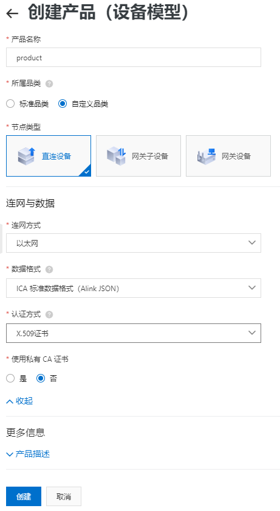
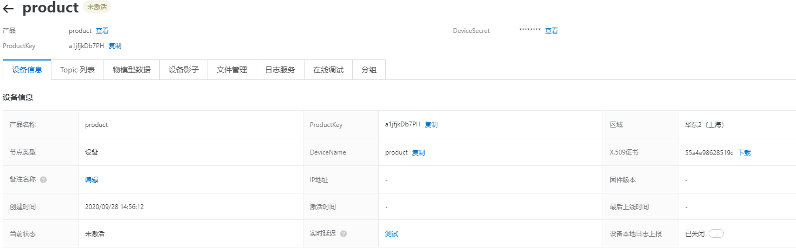
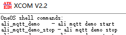
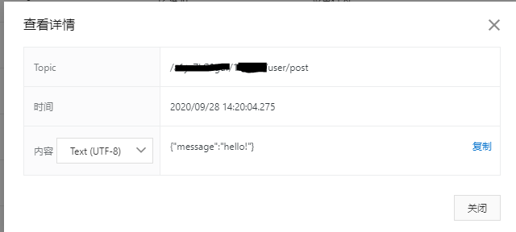

# 阿里云平台使用手册

# （以MQTT为例）

## 一、阿里云平台注册

### 1、注册阿里云平台账号

### 2、选择物联网平台-设备管理-产品

1）选择创建产品选项，根据指引和产品需求输入产品名称、所属品类、节点类型、联网方式和数据格式，认证方式若需要采用MQTT加密则选择X.590证书，是否使用私有CA证书根据实际应用情况而定。Productsecret在产品界面查看。

2）创建产品后前往设备管理，根据指引添加设备，输入设备名称Devicename，进入设备信息管，该页面中可查询设备三元信息（productkey、productsecret、devicename），下载CA证书。

 

[阿里云物联网平台文档中心](https://help.aliyun.com/product/30520.html?spm=a2c4g.750001.list.270.faf87b13Oji55Z)

## 二、MQTT

1、拷贝一个开发板工程到你的工程文件夹

 

2、打开cube工具进行配置（OneOS操作系统提供cube工具协助配置编译，若未配置好cube工具请先下载并按照教程将cube工具添加到右键工具栏），配置流程如下：

1）在工程文件所在的文件夹右键打开cube工具，命令行输入menuconfig，进入配置界面：

---------------------------------------------------------------------------------------------------------------------------------------

 (Top)
    Kernel  --->
    C standard library  --->
    Osal  --->
    Drivers  --->
    Components  --->
    **Thirdparty  --->**
    Boot Config  --->
    Debug  --->

---------------------------------------------------------------------------------------------------------------------------------------

选择Thirdparty选项，

---------------------------------------------------------------------------------------------------------------------------------------

(Top) → Thirdparty
    cJSON  --->
    Easyflash  --->
    NTP  --->
    WebClient  --->
    **Ali-iotkit  --->**
    MicroPython  --->

---------------------------------------------------------------------------------------------------------------------------------------

选择Ali-iotkit，进入配置界面，输入产品信息、密匙和设备信息、密匙，并勾选以下选项

若需要采取加密传输方式，则需额外勾选FEATURE_SUPPORT_TLS，并下载CA证书并在HAL_TLS_mbedtls.c文件中更改g_cli_crt和g_cli_key。文中样例采用以太网连接。

若需应用其他功能，则在以下配置中勾选相应的选项。

---------------------------------------------------------------------------------------------------------------------------------------

 (Top) → Thirdparty→ Ali-iotkit                                                                                                                                                                                                                                                                                                                                                           [ * ] Ali-iotkit: Aliyun cloud sdk 'iotkit-embedded'                                                                                                                                                                                     
        Version (v3.1.0)  --->                                                                                                                                                                                                                                
( ) Config Product Key                                                                                                                                                                                                                                     
( ) Config Product Secret                                                                                                                                                                                                                                 
( ) Config Device Name                                                                                                                                                                                                                                   
( ) Config Device Secret                                                                                                                                                                                                                                   
[ ]     PLATFROM_HAS_MBEDTLS                                                                                                                                                                                                                    
--     PLATFORM_HAS_STDINT                                                                                                                                                                                                                         
[ * ]     PLATFORM_HAS_DYNMEM                                                                                                                                                                                                                 
[ * ]     FEATURE_INFRA_NETWORK_PAYLOAD                                                                                                                                                                                             
[ * ]     FEATURE_INFRA_LOG                                                                                                                                                                                                                           
            Log Configurations  --->                                                                                                                                                                                                                       
[ * ]   FEATURE_MQTT_COMM_ENABLED                                                                                                                                                                                                      
            MQTT Configurations  --->                                                                                                                                                                                                                   
[ ]     FEATURE_DYNAMIC_REGISTER                                                                                                                                                                                                              
[ * ]     FEATURE_DEVICE_MODEL_ENABLED                                                                                                                                                                                                 
            Device Model Configurations  --->                                                                                                                                                                                                     
[ ]     FEATURE_SUPPORT_TLS                                                                                                                                                                                                                          
[ ]     FEATURE_OTA_ENABLED                                                                                                                                                                                                                        
[ ]     FEATURE_COAP_COMM_ENABLED                                                                                                                                                                                                        
[ ]     FEATURE_DEV_RESET                                                                                                                                                                                                                               
[ ]     FEATURE_HTTP_COMM_ENABLED                                                                                                                                                                                                        
[ ]     FEATURE_HTTP2_COMM_ENABLED                                                                                                                                                                                                      
[ ]     FEATURE_WIFI_PROVISION_ENABLED                                                                                                                                                                                                  
        Wifi Provision Configurations  --->                                                                                                                                                                                                         
[ ]     FEATURE_DEV_BIND_ENABLED                                                                                                                                                                                                              
[ * ]     Samples                                                                                                 

[*]         Enable MQTT sample   

---------------------------------------------------------------------------------------------------------------------------------------

2）配置完成后保存并退出，在命令行输入scons --ide=mdk5对项目进行编译。此外需在components->Network->LwIP->Enable lwIP stack->lwIP version中将版本更改为v2.1.2，否则可能在编译过程中报错。

---------------------------------------------------------------------------------------------------------------------------------------

(Top) → Components→ Network→ LwIP                                  on
[ * ] Enable lwIP stack
        lwIP version (lwIP v2.1.2)  --->

---------------------------------------------------------------------------------------------------------------------------------------

3、打开project文件（需要keil5），对项目进行编译，编译成功后连接开发板，并将项目下载到开发板中。

 

4、可准备一个串口工具，系统准备完成后可以在shell输入help查看指令。阿里云MQTT协议对应的demo的启动指令为ali_mqtt_demo，结束指令为ali_mqtt_demo_stop。

  阿里云平台设备管理上显示在线，终端会与阿里云平台进行周期性通信：

终端周期性向阿里云平台发送{"message":"hello!"}

阿里云平台可接受到终端发送来的消息。具体消息内容看在阿里云物联网平台的控制台日志服务处进行查看。

 

消息状态为200时表示终端与云正常通信，状态为其他错误码时可根据阿里云帮助文档进行相应错误排查。

[云端运行文档地址](https://help.aliyun.com/document_detail/44542.html?spm=5176.11485173.0.dexternal.2fc459afOtleGp)

