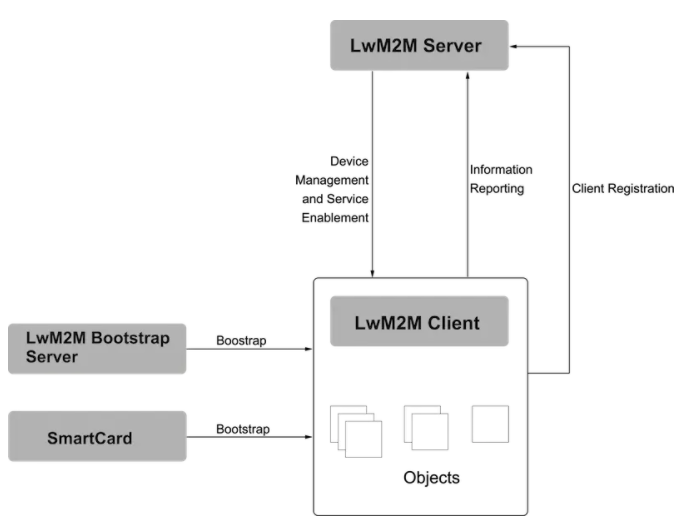
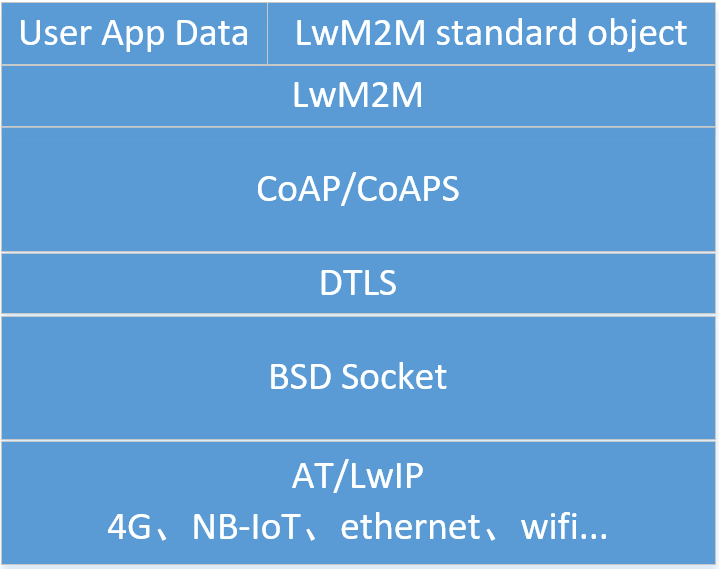
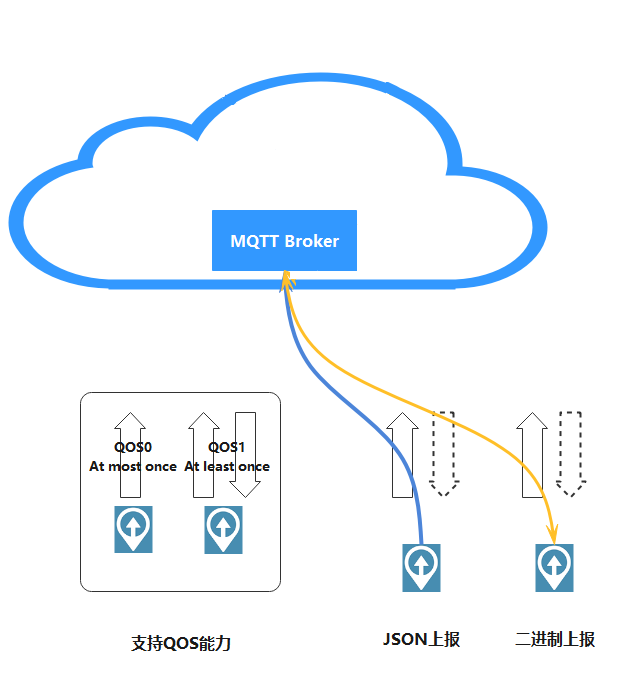
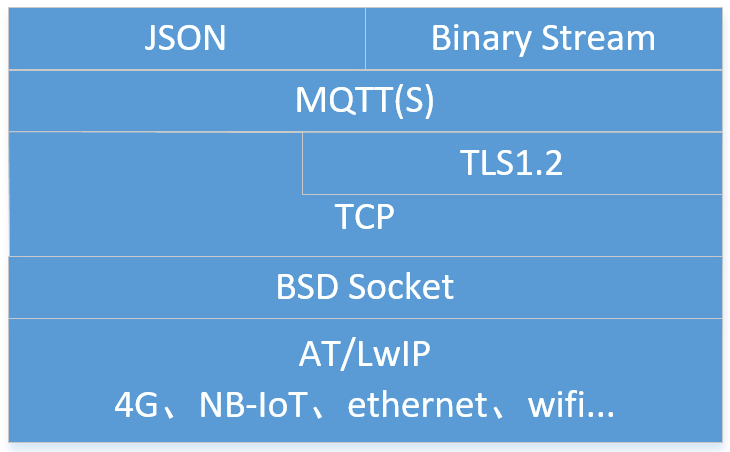

# Huawei Cloud Kit - V1.1.0

## 简介

国内公有云市场竞争白热化，以阿里云、腾讯云、华为云等为代表的头部云服务商正成为众多企业上云首选合作伙伴。华为云作为前三大的公有云服务提供商，很多物联网应用采用对接华为云作为端云连接的解决方案。为了使开发者更聚焦于业务，因此Huawei Cloud Kit提供一种快速连接华为云的手段，开发者可以通过配置，自由选择以太网、2G/3G/4G/5G、NB-IoT、Wifi等多种网络接入物联网平台，并通过LwM2M/MQTT协议与华为云连接。

V1.0.0功能简介：

- 华为端云互通组件SDK移植。
- 实现LwM2M（Lightweight Machine-To-Machine）协议连接，包括设备注册，属性上报，命令下发。

V1.1.0功能简介：

- 实现MQTT(S)协议连接，支持设备发布/订阅消息
- 支持加密与非加密方式接入
- 支持PSK、CA证书两种认证方式接入华为云


## 代码结构

| 目录    | 说明                                          |
| ------- | --------------------------------------------- |
| adpter  | OneOS适配文件，包括内核调用及网络层的适配代码 |
| demos   | 示例程序                                      |
| doc     | 说明文档                                      |
| include | LiteOS端云互通SDK头文件                       |
| src     | LiteOS端云互通SDK源文件                       |


## LwM2M协议连接

#### LwM2M实体间的关系



协议最主要的实体包括LwM2M Server和LwM2M Client。

- LwM2M Server作为服务器，部署在M2M服务供应商处或网络服务供应商处。
- LwM2M Client作为客户端，部署在各个LwM2M设备上。
- LwM2M Bootstrap Servery或SmartCard，引导服务器及智能卡为可选项，用户可以将LwM2M Server相关信息直接写入设备。

备注：当前版本不支持Bootstrap，用户需要将LwM2M Server相关信息写入设备，或直接通过域名连接IoT平台。

#### 网络层次

 

- OMA的LwM2M规范中定义了8个标准对象：Security、Server、Access Control、Device、Connectivity Monitoring、Firmware、Location、Connectivity Statistics；华为云平台另外支持对象ID为19的LwM2M App data，本对象内的数据格式由用户自定义，并且需要在与平台侧的物模型相对应。

  | Object                                    | Object ID |
  | ----------------------------------------- | --------- |
  | LwM2M Security（安全对象）                | 0         |
  | LwM2M Server（服务器对象）                | 1         |
  | Access Control（访问控制对象）            | 2         |
  | Device（设备对象）                        | 3         |
  | Connectivity Monitoring（连通性监控对象） | 4         |
  | Firmware（固件对象）                      | 5         |
  | Location（位置对象）                      | 6         |
  | Connectivity Statistics（连通性统计对象） | 7         |
  | LwM2M App data（应用数据对象）            | 19        |

- 支持CoAP和CoAPS，加密与非加密方式与华为云平台连接，用户可以通过menuconfig来修改此选项。

- 网络传输工作中BSD Socket之上，AT、LwIP协议栈选择，以及底层链路硬件选择与华为云连接组件无关。

#### 配置选项

使用huawei cloud kit需要通过Menuconfig的图形化工具进行配置选择，配置的路径如下所示：

```text
(Top) → Components→ Cloud→ Huawei
                                              OneOS Configuration
    [*] Using huawei cloud connect component
        Transport Protocol (LwM2M)  --->
	[*] Enable/Disable (D)TLS
        Secret Key Type (PSK)  --->
            (12345678) Config PSK Value
	[*] Enable LwM2M demo program
		(119.3.250.80) LwM2M Server Address
		(dev_0) Config Device ID Code
```

##### 配置入口

​        配置路径：Components→ Cloud→ Huawei

##### 参数说明

​		Transport Protocol (LwM2M) : 连接协议选择，选择LwM2M；

​		Enable/Disable (D)TLS：使能/去使能(D)TLS；

​		Secret Key Type (PSK)：选择密钥方式；

​		Config PSK Value：配置PSK密钥参数；

​		Enable LwM2M demo program：使能LwM2M示例程序；

​		LwM2M Server Address：LwM2M服务器地址，支持IP及域名输入；

​		Config Device ID Code：配置身份码，同云平台的“设备标识码”保持一致。


## MQTT(S)协议连接

MQTT（Message Queuing Telemetry Transport，消息队列遥测传输协议），是一种基于发布/订阅（publish/subscribe）模式的"轻量级"通讯协议，该协议构建于TCP/IP协议上，由IBM在1999年发布。MQTT最大优点在于，可以以极少的代码和有限的带宽，为连接远程设备提供实时可靠的消息服务。作为一种低开销、低带宽占用的即时通讯协议，使其在物联网、小型设备、移动应用等方面有较广泛的应用。

MQTT是一个基于客户端-服务器的消息发布/订阅传输协议。MQTT协议是轻量、简单、开放和易于实现的，这些特点使它适用范围非常广泛。在很多情况下，包括受限的环境中，如：机器与机器（M2M）通信和物联网（IoT）。其在，通过卫星链路通信传感器、偶尔拨号的医疗设备、智能家居、及一些小型化设备中已广泛使用。



- 支持QoS0和QoS1
- 支持JSON格式及二进制数据上报

#### 网络层次



- 支持MQTT、MQTTS两种方式接入
- 网络传输工作中BSD Socket之上

#### 使用限制

| 描述                                                       | 限制                                                         |
| ---------------------------------------------------------- | ------------------------------------------------------------ |
| 支持的MQTT协议版本                                         | 3.1.1                                                        |
| 与标准MQTT协议的区别                                       | 支持QoS 0和QoS 1，支持Topic自定义，不支持QoS2，不支持will、retain msg |
| MQTTS支持的安全等级                                        | 采用TCP通道基础 + TLS协议（TLSV1.2 版本）                    |
| 单帐号每秒最大MQTT连接请求数                               | 无限制                                                       |
| 单个设备每分钟支持的最大MQTT连接数                         | 1                                                            |
| 单个MQTT连接每秒的吞吐量，即带宽，包含直连设备和网关       | 3KB/s                                                        |
| MQTT单个发布消息最大长度，超过此大小的发布请求将被直接拒绝 | 1MB                                                          |
| MQTT连接心跳时间建议值                                     | 心跳时间限定为30至1200秒，推荐设置为120秒                    |
| 产品是否支持自定义Topic                                    | 不支持                                                       |
| 消息发布与订阅                                             | 设备只能对自己的Topic进行消息发布与订阅                      |
| 每个订阅请求的最大订阅数                                   | 无限制                                                       |

#### 配置选项

使用huawei cloud kit需要通过Menuconfig的图形化工具进行配置选择，配置的路径如下所示：

```text
(Top) → Components→ Cloud→ Huawei
                                              OneOS Configuration
    [*] Using huawei cloud connect component
        Transport Protocol (MQTT)  --->
    [*] Enable/Disable (D)TLS
        Secret Key Type (PSK)  --->
            (12345678) Config PSK Value (NEW)
    [*] Enable MQTT demo program
        (121.36.42.100) MQTT Server Address (NEW)
        (123456) Config Product ID (NEW)
        (dev_0) Config Device ID Code (NEW)
```

##### 配置入口

​        配置路径：Components→ Cloud→ Huawei

##### 参数说明

​		Transport Protocol (MQTT) : 连接协议选择，选择MQTT；

​		Enable/Disable (D)TLS：使能/去使能TLS，去使能TLS后，所有报文将以明文形式发送，建议使能TLS；

​		Secret Key Type (PSK)：选择密钥方式，支持PSK及CA证书方式接入；

​		Config PSK Value：配置PSK密钥参数；

​		Enable MQTT demo program：使能MQTT 示例程序；

​		MQTT Server Address：MQTT服务器地址，支持IP及域名输入；

​		Config Product ID：配置产品ID，为云平台自动分配的产品ID。

​	    Config Device ID Code：配置设备标识码，为注册设备时，用户输入的设备标识码


## 平台侧配置

1. 注册华为云账户

   根据网站指引，注册华为云账户--[华为云](https://www.huaweicloud.com/?locale=zh-cn)

2. 创建产品

   参照华为云开发指南--[创建产品](https://support.huaweicloud.com/devg-iothub/iot_01_0053.html)

3. 产品开发

   参考华为云开发指南--[产品开发指引](https://support.huaweicloud.com/devg-iothub/iot_01_0058.html)

4. 注册设备

   参考华为云开发指南--[注册设备](https://support.huaweicloud.com/usermanual-iothub/iot_01_0028.html)及[设备鉴权](https://support.huaweicloud.com/usermanual-iothub/iot_01_0019.html)

   

## CA证书配置

若选择MQTTS协议接入，并采用x.509证书方式认证，则用户需要如下操作

1. 制作证书

   参考华为云帮助文档--[注册X.509证书认证的设备](https://support.huaweicloud.com/usermanual-iothub/iot_01_0055.html#ZH-CN_TOPIC_0222727053__li6976113417455)

2. 上传证书

   上传并验证证书，需要同时在两个地方配置

   华为云物联网平台=>设备=>设备CA证书

   华为云物联网平台=>设备发放=>证书

   可以参考华为云帮助文档--[MQTT X.509证书认证接入示例](https://support.huaweicloud.com/qs-iothub/iot_05_0015.html)

   

## 注意事项

1. PSK参数配置

   由于云平台支持的密钥长度为8-32位，只支持16进制密钥，且DTLS传输时密钥采用16进制数传输，因此有如下限制：

   a. 密钥只支持0-9,A-F,a-f输入；

   b.密钥长度须为偶数位。

