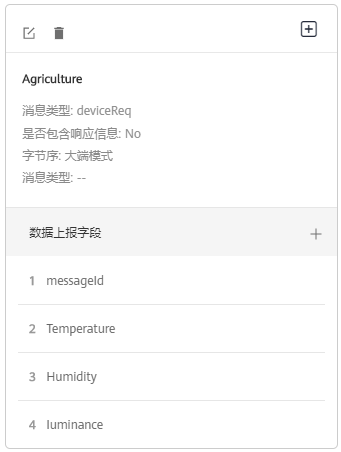
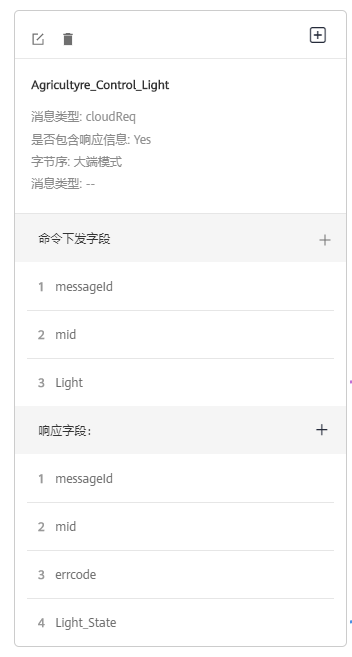
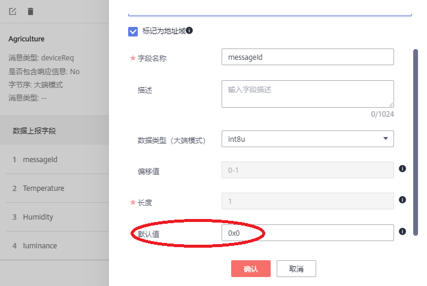
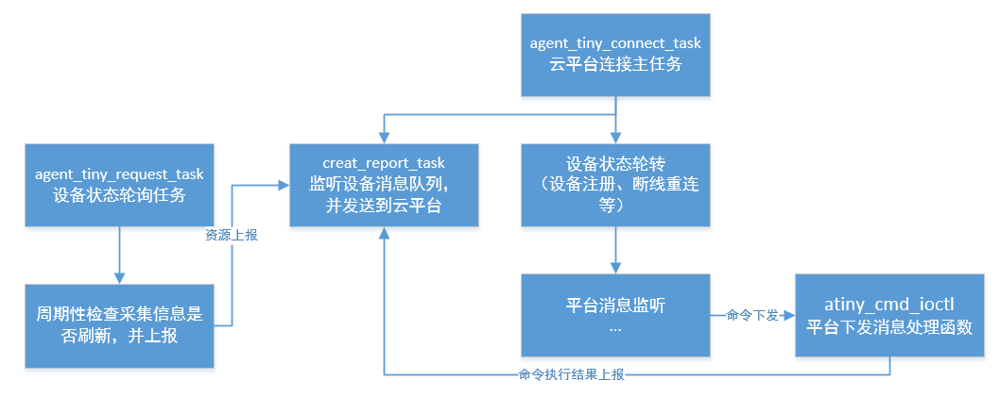
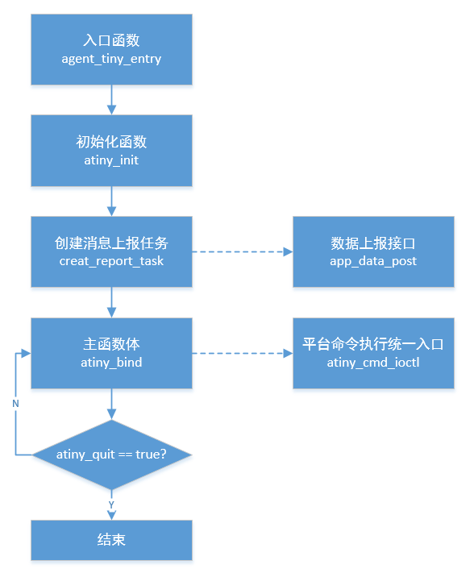
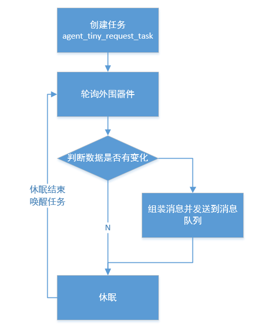
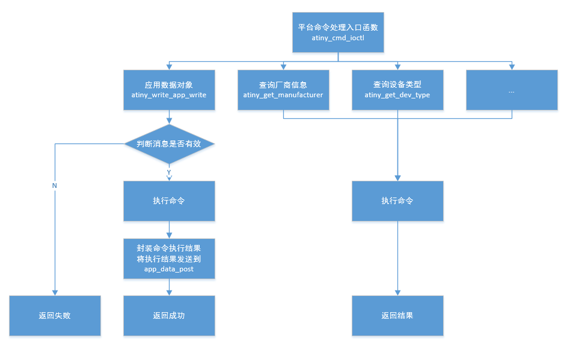
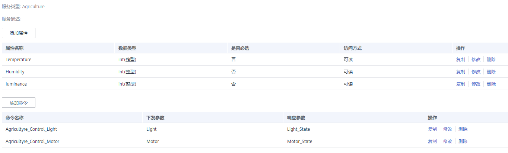
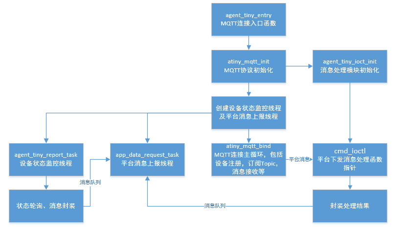

# Huawei Cloud API

## 简介

华为云连接套件提供基于LwM2M/MQTT/MQTTS协议连接、设备注册、数据上报、命令下发等功能，用户可以根据实际需要调用相应API实现快速上云。


## LwM2M协议API函数接口说明

| 接口               | 说明                            |
| ------------------ | ------------------------------- |
| atiny_init         | 端云互通组件的初始化接口        |
| atiny_deinit       | 端云互通组件参数的去初始化接口  |
| atiny_bind         | IoT平台连接主循环               |
| atiny_data_report  | 上报消息到IoT平台               |
| atiny_reconnect    | 设备与IoT平台初次连接及断线重连 |
| atiny_cmd_ioctl    | 执行平台命令                    |
| atiny_event_notify | 事件通知回调函数                |
| atiny_data_change  | 通知本地LwM2M对象实例参数变化   |

### atiny_init

端云互通组件参数的初始化接口，该函数主要是将IoT服务器端相关参数封装到phandle中。

```c
int atiny_init(atiny_param_t* atiny_params, void** phandle);
```

| 参数         | 说明                      |
| ------------ | ------------------------- |
| atiny_params | IoT服务器相关配置参数指针 |
| phandle      | LwM2M句柄指针地址         |
| **返回**     | **说明**                  |
| 0            | 执行成功                  |
| 其他         | 执行失败                  |

### atiny_deinit

端云互通组件参数的去初始化接口。

```c
void atiny_deinit(void* phandle);
```

| 参数     | 说明              |
| -------- | ----------------- |
| phandle  | LwM2M句柄指针地址 |
| **返回** | **说明**          |
| 无       |                   |

### atiny_bind

IoT平台连接主循环，调用成功后，除非用户主动结束，否则不会返回。该接口是IoT平台连接主循环体，实现了LwM2M协议处理，注册状态机，重传队列，订阅上报。

```c
int atiny_bind(atiny_device_info_t* device_info, void* phandle)
```

| 参数        | 说明                                           |
| ----------- | ---------------------------------------------- |
| device_info | 终端设备参数结构体，包含设备验证码、厂商信息等 |
| phandle     | LwM2M句柄指针地址                              |
| **返回**    | **说明**                                       |
| 0           | 用户主动结束返回成功                           |
| 非0         | 执行失败返回错误码                             |

atiny\_bind\(\)会根据LwM2M协议标准，进行LwM2M客户端创建与注册，并将数据上报任务app\_data\_report\(\)中上报的数据递交给通信模块发送到IoT平台，同时接受IoT平台下发的命令消息，解析后由命令处理接口atiny\_cmd\_ioctl\(\)统一进行处理。

### atiny_data_report

该接口用于设备数据上报接口，在本接口中调用CoAP层对report_data封装并发送到IoT平台。

```c
int atiny_data_report(void* phandle, data_report_t* report_data)
```

| 参数        | 说明               |
| ----------- | ------------------ |
| phandle     | LwM2M句柄指针地址  |
| report_data | 上报数据结构体指针 |
| **返回**    | **说明**           |
| 0           | 执行成功           |
| 其他        | 执行失败           |

### atiny_reconnect

用于设备与IoT平台初次连接及断线重连，本函数中仅置标志位，实际连接动作在atiny_bind函数中实现

```c
int atiny_reconnect(void* phandle);
```

| 参数     | 说明              |
| -------- | ----------------- |
| phandle  | LwM2M句柄指针地址 |
| **返回** | **说明**          |
| 0        | 执行成功          |
| 其他     | 执行失败          |

### atiny_cmd_ioctl

IoT平台命令处理接口函数，由开发者实现。该接口是LwM2M标准对象向设备下发命令的统一入口。

```c
int atiny_cmd_ioctl (atiny_cmd_e cmd, char* arg, int len)
```

| 参数     | 说明                                               |
| -------- | -------------------------------------------------- |
| cmd      | 具体命令字，比如下发业务数据，下发复位，升级命令等 |
| arg      | 存放命令参数的缓存                                 |
| len      | 缓存大小                                           |
| **返回** | **说明**                                           |
| 0        | 执行成功                                           |
| 其他     | 执行失败                                           |

atiny\_cmd\_ioctl\(\)是华为云连接组件定义的一个通用可扩展的接口，其命令字如atiny\_cmd\_e所定义，用户根据自身需求进行选择性实现，也可以根据自身需求进行扩展。常用的接口定义如下表所示，每一个接口都和atiny\_cmd\_e的枚举值一一对应：

| 回调接口函数                                             | 描述                                                         |
| -------------------------------------------------------- | ------------------------------------------------------------ |
| int atiny_get_manufacturer(char* manufacturer,int  len)  | 获取厂商名字，参数manufacturer指向的内存由LiteOS  SDK端云互通组件分配，户填充自身的厂商名字，长度不能超过参数len。 |
| int atiny_get_dev_type(char * dev_type,int len)          | 获取设备类型，参数dev_type指向的内存由LiteOS  SDK端云互通组件分配，户填充自身的设备类型，长度不能超过参数len。 |
| int atiny_get_model_number((char * model_numer, int len) | 获取设备模型号，参数model_numer指向的内存由LiteOS  SDK端云互通组件分配，户填充自身的设备模型号，长度不能超过参数len。 |
| int atiny_get_serial_number(char* num,int len)           | 获取设备序列号，参数numer指向的内存由LiteOS  SDK端云互通组件分配，户填充自身的设备序列号，长度不能超过参数len。 |
| int atiny_get_dev_err(int* arg，int len)                 | 获取设备状态，比如内存耗尽、电池不足、信号强度低等，参数arg由LiteOS  SDK端云互通组件分配，用户填充，长度不能超过len。 |
| int atiny_do_dev_reboot(void)                            | 设备复位。                                                   |
| int atiny_do_factory_reset(void)                         | 厂商复位。                                                   |
| int atiny_get_baterry_level(int* voltage)                | 获取电池剩余电量。                                           |
| int atiny_get_memory_free(int* size)                     | 获取空闲内存大小。                                           |
| int atiny_get_total_memory(int* size)                    | 获取总共内存大小。                                           |
| int atiny_get_signal_strength(int* singal_strength)      | 获取信号强度。                                               |
| int atiny_get_cell_id(long* cell_id)                     | 获取小区ID。                                                 |
| int atiny_get_link_quality(int* quality)                 | 获取信道质量。                                               |
| int atiny_write_app_write(void* user_data, int len)      | 业务数据下发，用户可以根据自身的业务，在此函数中实现自定义命令响应。 |
| int atiny_update_psk(char* psk_id, int len)              | 预置共享密钥更新。                                           |

### atiny_event_notify

设备事件通知回调函数，用户可以根据实际需求判断是否实现，当设备与IoT平台连接后，状态变化回调该函数通知用户。

```c
void atiny_event_notify(atiny_event_e event, const char* arg, int len)
```

| 参数     | 说明           |
| -------- | -------------- |
| event    | 事件类型枚举   |
| arg      | 存放参数的缓存 |
| len      | 缓存大小       |
| **返回** | **说明**       |
| 无       |                |

### atiny_data_change

设备事件通知回调函数，用户可以根据实际需求判断是否实现，当设备与IoT平台连接后，状态变化回调该函数通知用户。

```c
int atiny_data_change(void* phandle, const char* data_type)
```

| 参数      | 说明               |
| --------- | ------------------ |
| phandle   | LwM2M句柄指针地址  |
| data_type | LwM2M对象url字符串 |
| **返回**  | **说明**           |
| 0         | 执行成功           |
| 其他      | 执行失败           |


## MQTT协议API函数接口说明

| 接口                   | 说明                           |
| ---------------------- | ------------------------------ |
| atiny_mqtt_init        | 初始化MQTT协议                 |
| atiny_mqtt_bind        | MQTT协议连接主循环             |
| atiny_mqtt_data_send   | 设备消息发布到平台             |
| atiny_mqtt_isconnected | 判断MQTT客户端是否连接到云平台 |

### atiny_mqtt_init

此函数用于初始化MQTT协议，将用户配置（atiny_params）解析后存入MQTT客户端操作句柄中（phandle）。

```c
int  atiny_mqtt_init(const mqtt_param_s* atiny_params, mqtt_client_s** phandle)
```

| 参数         | 说明                       |
| ------------ | -------------------------- |
| atiny_params | MQTT配置参数指针           |
| phandle      | MQTT客户端操作句柄指针地址 |
| **返回**     | **说明**                   |
| 0            | 执行成功                   |
| 其他         | 执行失败                   |

mqtt_param_s结构体说明

| 参数                 | 说明                                     |
| -------------------- | ---------------------------------------- |
| server_ip            | MQTT服务器IP地址或域名                   |
| server_port          | MQTT服务器端口                           |
| mqtt_security_info_s | 加密相关信息，包含psk及ca相关参数        |
| cmd_ioctl            | 订阅消息执行函数地址，该函数需要用户实现 |

### atiny_mqtt_bind

该函数用于实现MQTT协议连接，并与MQTT服务器端交互，该函数在正确连接云平台后不退出，需要在一个任务或线程中调用该函数。

```c
int atiny_mqtt_bind(const mqtt_device_info_s* device_info, mqtt_client_s* phandle)
```

| 参数        | 说明                   |
| ----------- | ---------------------- |
| device_info | 设备相关信息           |
| phandle     | MQTT客户端操作句柄指针 |
| **返回**    | **说明**               |
| 0           | 执行成功               |
| 其他        | 执行失败               |

### atiny_mqtt_data_send

该函数用于设备发送消息到云平台，用户可以调用该函数将消息发布到云平台。

```c
int atiny_mqtt_data_send(mqtt_client_s* phandle, const char *msg,  uint32_t msg_len, mqtt_qos_e qos)
```

| 参数     | 说明                                           |
| -------- | ---------------------------------------------- |
| phandle  | MQTT客户端操作句柄指针                         |
| msg      | 待发布消息缓存指针                             |
| msg_len  | 待发布消息长度                                 |
| qos      | 消息服务模式，由于平台限制，只支持QoS 0、QoS 1 |
| **返回** | **说明**                                       |
| 0        | 执行成功                                       |
| 其他     | 执行失败                                       |

### atiny_mqtt_isconnected

该函数用于判断设备是否已连接到云平台。

```c
int atiny_mqtt_isconnected(mqtt_client_s* phandle)
```

| 参数     | 说明                   |
| -------- | ---------------------- |
| phandle  | MQTT客户端操作句柄指针 |
| **返回** | **说明**               |
| 0        | 未连接                 |
| 1        | 已连接                 |


## LwM2M示例说明

#### 平台侧开发-设备属性定义

本结构体格式需要与云平台上产品定义栏的物模型定义保持一致，如下图所示：

具体操作可以参考[华为云产品开发指南](https://support.huaweicloud.com/devg-iothub/iot_01_0058.html)



本地结构体：

```c
#pragma pack(1)		//结构体必须采用1字节对齐
typedef struct
{
    UINT8  message_id;
    UINT8  temperature;
    UINT8  humidity;
    UINT16 luminance;
} app_attr_data_t;
#pragma pack()
```

| 重要成员    | 说明                                   |
| ----------- | -------------------------------------- |
| message_id  | 对应云平台的messageId，长度为1个字节   |
| temperature | 对应云平台的Temperature，长度为1个字节 |
| humidity    | 对应云平台的Humidity，长度为1个字节    |
| luminance   | 对应云平台的Luminance，长度为2个字节   |

注意：

1. 结构体必须采用1字节对齐；
2. 云平台数据字节序采用大端模式，数据发送前需将主机字节序转换为网络字节序（大端）。

#### 平台侧开发-下发命令定义

华为云平台可以定义多个命令消息，均以命令和响应字段构成，此处以控制灯命令消息举例。



```c
#pragma pack(1)
typedef struct
{
    struct __app_light_cmd__
    {
        UINT8 message_id;
        INT16 mid;
        char  cmd_light[3];
    } cmd;
    struct __app_light_response__
    {
        UINT8 message_id;
        INT16 mid;
        UINT8 err_code;
        UINT8 state_light;
    } resp;
} app_cmd_controlLight_t;
#pragma pack()
```

| 重要成员         | 说明                                                 |
| ---------------- | ---------------------------------------------------- |
| cmd.message_id   | 对应云平台命令下发字段中的messageId，长度为1个字节   |
| cmd.mid          | 对应云平台命令下发字段中的mid，长度为1个字节         |
| cmd.cmd_light    | 对应云平台命令下发字段中的Light，长度为3个字节       |
| resp.message_id  | 对应云平台命令响应字段中的messageId，长度为1个字节   |
| resp.mid         | 对应云平台命令响应字段中的mid，长度为2个字节         |
| resp.err_code    | 对应云平台命令响应字段中的errcode，长度为1个字节     |
| resp.state_light | 对应云平台命令响应字段中的Light_State，长度为1个字节 |

注意：

1. 结构体必须采用1字节对齐；
2. 云平台数据字节序采用大端模式，数据发送前需将主机字节序转换为网络字节序（大端）。

#### 平台侧开发-端云消息ID定义

每条消息中均有messageId字段，需要与平台设置的默认值相同才能识别，图片展示的是设备属性上报的messageId，其值为0。



```c
typedef enum
{
    APP_MESSAGE_POST_ATTR_ID              = 0,
    APP_MESSAGE_CMD_CONTROL_LIGHT_ID      = 1,
    APP_MESSAGE_RESPONSE_CONTROL_LIGHT_ID = 2,
    APP_MESSAGE_CMD_CONTROL_MOTOR_ID      = 3,
    APP_MESSAGE_RESPONSE_CONTROL_MOTOR_ID = 4
} app_message_id_t;
```

| 重要成员                              | 说明                     |
| ------------------------------------- | ------------------------ |
| APP_MESSAGE_POST_ATTR_ID              | 属性上报消息ID           |
| APP_MESSAGE_CMD_CONTROL_LIGHT_ID      | 灯控制命令下发消息ID     |
| APP_MESSAGE_RESPONSE_CONTROL_LIGHT_ID | 灯控制命令响应消息ID     |
| APP_MESSAGE_CMD_CONTROL_MOTOR_ID      | 马达控制命令下发消息ID   |
| APP_MESSAGE_RESPONSE_CONTROL_MOTOR_ID | 马达控制命令响应消息ID节 |

#### 设备侧开发-业务流程

 

- 由agent_tiny_connect_task创建云平台连接主任务，包括：

  - 参数初始化：服务器端IP、端口等；设备标识码，认证密钥、生存时间、绑定模式等参数配置；
  - 创建终端消息上报线程：监听终端本地消息，包含设备主动上报消息和平台命令回复消息；
  - 设备状态轮转：BootStrap（暂不支持）、设备注册、observe轮转、平台消息监听等。

- 由agent_tiny_request_task创建设备状态轮询任务，当设备属性刷新时，向report_task发送上报请求。

- 由atiny_cmd_ioctl函数处理由平台主动发起的请求，包含9中对象的查询和设置；设置消息处理完成后向report_task发送处理结果消息。

#### 设备侧开发-主线程分解

agent_tiny_entry为为华为云连接组件的入口函数。该接口将进行agent tiny的初始化相关操作，创建上报任务，并调用agent tiny主函数体。

```c
void agent_tiny_entry(void)
```



#### 设备侧开发-属性上报过程分解

属性上报任务由agent_tiny_request_task函数创建，在任务中定时轮询设备当前状态，若采集到的参数发生变换，由本任务发送消息到app_data_post接口。

```c
void agent_tiny_request_task(void *parameter)
```



#### 设备侧开发-命令执行过程分解

命令执行过程由atiny_cmd_ioctl函数为IoT平台命令处理入口函数，由开发者实现。

具体各条命令的执行函数，包括LwM2M中已使用的对象均由开发者实现。

```c
int atiny_cmd_ioctl (atiny_cmd_e cmd, char* arg, int len)
int atiny_write_app_write(void *user_data, int len)
int atiny_get_manufacturer(char* manufacturer,int len)
int atiny_get_dev_type(char * dev_type,int len)
int atiny_get_model_number((char * model_numer, int len)
int atiny_get_serial_number(char* num,int len)
int atiny_get_dev_err(int* arg，int len)
int atiny_do_dev_reboot(void)
int atiny_do_factory_reset(void)
int atiny_get_baterry_level(int* voltage)
int atiny_get_memory_free(int* size)
int atiny_get_total_memory(int* size)
int atiny_get_signal_strength(int* singal_strength)
int atiny_get_cell_id(long* cell_id)
int atiny_get_link_quality(int* quality)
int atiny_write_app_write(void* user_data, int len)
int atiny_update_psk(char* psk_id, int len)
```





## MQTT示例说明

#### 平台侧开发-创建产品

在华为云平台上创建MQTT产品，协议类型选择MQTT，创建过程可以参考帮助文档--[创建产品](https://support.huaweicloud.com/devg-iothub/iot_01_0053.html)，本示例数据格式采用JSON格式。

#### 平台侧开发-模型定义

产品创建成功后，在该产品中定义产品模型，可以参考帮助文档--[在线开发产品模型](https://support.huaweicloud.com/devg-iothub/iot_02_0005.html)

示例中产品模型定义如下：



#### 平台侧开发-注册设备

华为云提供两种方式的设备认证类型：密钥、X.509证书，用户可以根据实际需要选择认证方式，可以参考帮助文档--[MQTT密钥接入示例](https://support.huaweicloud.com/qs-iothub/iot_05_0014.html)、[MQTT X.509证书认证接入示例](https://support.huaweicloud.com/qs-iothub/iot_05_0015.html)

#### 设备侧开发-业务流程



- 函数agent_tiny_entry为MQTT连接入口，由于该函数连接成功后不会返回，采用任务方式调用：

  - 参数初始化：服务器端IP、端口、产品ID、设备标识码，认证密钥或证书等
  - 初始化消息处理模块
  - 创建平台消息上报线程
  - 创建设备状态监控线程
- 由app_data_request_task任务监听设备内部消息队列，统一向云平台发送设备消息。
- 由agent_tiny_report_task任务轮询设备状态，设备状态发生变化时，由其封装消息并发送给app_data_request_task。
- 平台消息回调函数cmd_ioctl，在处理完平台消息后，将处理结果封装成消息，发送给app_data_request_task。


#### 设备侧开发-X.509证书

由于X.509证书方式接入较为复杂，这里单独说明：

X.509证书接入在设备侧需要三个文件：服务器CA证书、客户端CA证书、客户端私钥。

服务器CA证书，可以通过此链接直接[下载](https://developer.obs.cn-north-4.myhuaweicloud.com/cert/v2/certificate.zip)，您可以通过记事本方式打开certificate/c/DigiCertGlobalRootCA.crt.pem文件获取服务器的CA证书。

客户端证书与客户端私钥可以通过以下方式生成--[生成调测证书](https://support.huaweicloud.com/usermanual-iothub/iot_01_0055.html#ZH-CN_TOPIC_0222727053__li6976113417455)，其中deviceCert.pem为客户端CA证书，deviceCert.key为客户端私钥。