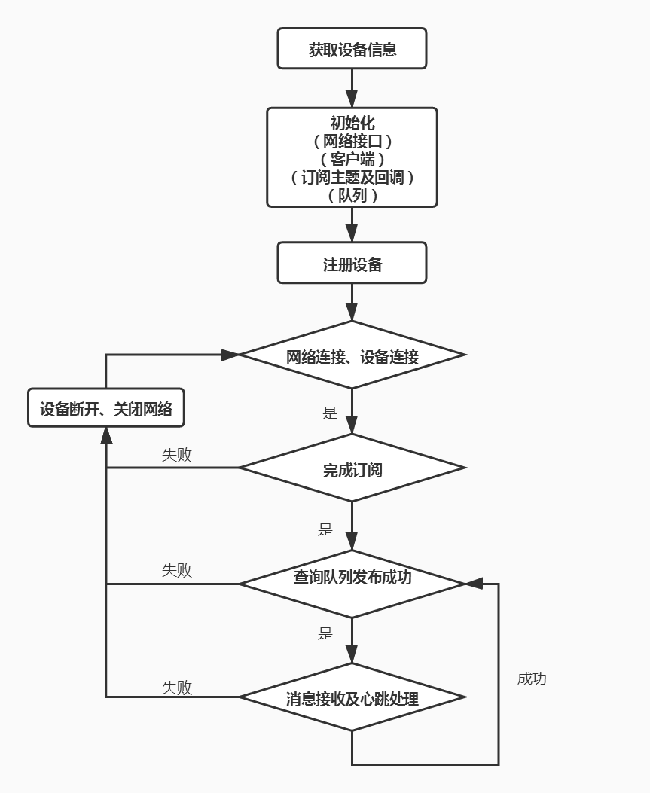

# OneNET-MQTT-Kit用户指南

------

## 简介

OneNET-MQTT组件是基于Paho mqtt Embedded C v1.1.0源码包上做的开发，提供自动注册设备、平台接入、主题订阅、消息发布、命令下发、心跳保持、离线重连，并支持TLS加密传输。

## 目录结构

OneNET-MQTT 源代码目录结构如下表所示：

| 目录          | 说明                             |
| ------------- | -------------------------------- |
| mqtts_device  | mqtt设备相关接口实现及主业务实现 |
| authorization | 鉴权相关接口实现                 |
| cert          | 存放平台根证书                   |

## 架构设计

为了保证设备在异常状态下实现快速重连，设计框架如下：



- 获取设备信息。包含OneNET平台MQTTS物联网套件上注册的产品ID，产品access_key，设备名称，非自动化注册设备还需要获取设备ID和设备key。
- 初始化。包含MQTT网络相关接口的初始化、MQTT客户端初始化、订阅相关接口初始化（主题和相应的消息回调初始化）、发布消息队列初始化。
- 设备注册。设备向注册服务器注册一个设备，用户只提供产品ID，产品access_key，设备名， 其中设备名需要保证唯一，可以采用SN、IMEI等，支持数字、字母、字符'_'和'-'，长度不超过64。设备支持反复注册。注册前会计算API访问的Token。
- 网络和设备连接。开启TLS加密传输时，需要用到平台CA证书，网络连接成功后进行设备连接。设备连接前会计算设备连接的Token（默认过期时间是2032/1/1，可根据用户需求更改），作为MQTT接入平台时的客户端密码。
- 订阅。根据初始化的订阅主题（目前5个主题）进行订阅，每个主题最多尝试3次，每个主题订阅成功后，注册该主题的回调函数。若此5个主题中有任何一个订阅不成功，会关闭客户端，关闭网络，重新进行网络和设备连接。
- 发布。会查询发布消息队列中是否有消息（消息队列中的消息结构体包含主题类型、数据和数据长度），有消息就会将要发布的消息发布到对应的主题。消息的服务质量默认为Qos1（用户可修改），因此发布后会同步等待ACK，若超时则判断为失败，会关闭客户端和网络，重新进行网络和设备连接。
- 消息接收及心跳处理。订阅的5个主题，若平台有发布此5个主题的消息，则会接收到并执行主题消息回调函数。心跳包会在用户配置的心跳间隔时间发送，以保持设备的长连接。若消息接收失败，会关闭客户端和网络，重新进行网络和设备连接。

## OneNET平台相关

### OneNET支持的订阅Topic ：

|      | **系统topic**                                  |             **用途**             | **QoS** | **可订阅** |
| ---- | ---------------------------------------------- | :------------------------------: | ------- | :--------- |
| 1    | $sys/{pid}/{device-name}/dp/post/json/accepted |   系统通知"设备上传数据点成功"   | 0       | √          |
| 2    | $sys/{pid}/{device-name}/dp/post/json/rejected |   系统通知"设备上传数据点失败"   | 0       | √          |
| 3    | $sys/{pid}/{device-name}/cmd/request/+         |        系统向设备下发命令        | 0       | √          |
| 4    | $sys/{pid}/{device-name}/cmd/response/+/+      | 系统回复"设备命令应答成功或失败" | 0       | √          |
| 5    | $sys/{pid}/{device-name}/image/#               |       设备镜像相关所有主题       | 0       | √          |

### OneNET支持的发布Topic ：

|      | **系统topic**                                 |      **用途**      | **QoS** | **可发布** |
| ---- | --------------------------------------------- | :----------------: | ------- | ---------- |
| 1    | $sys/{pid}/{device-name}/dp/post/json         |   设备上传数据点   | 0/1     | √          |
| 2    | $sys/{pid}/{device-name}/cmd/response/{cmdid} |  设备回复命令应答  | 0/1     | √          |
| 3    | $sys/{pid}/{device-name}/image/update         | 设备更新镜像中属性 | 0/1     | √          |
| 4    | $sys/{pid}/{device-name}/image/get            |  设备镜像信息查询  | 0/1     | √          |

### 加密与非加密

| **连接协议** | **地址**      | **端口** | **说明**   |
| ------------ | ------------- | -------- | ---------- |
| MQTT         | 183.230.40.16 | 8883     | 加密接口   |
| MQTT         | 183.230.40.96 | 1883     | 非加密接口 |

## 使用说明

### 图形化配置

使用OneNET MQTT套件需要通过Menuconfig的图形化工具进行配置选择，配置的路径如下所示：

```
(Top) → Components → Cloud → OneNET → MQTT Kit
[*] Enable onenet mqtt-kit
[ ]     Enable onenet device auto register
[ ]     Enable mqtt-kit TLS encrypt
```

进行OneNET MQTT Kit 选项配置需要先在Menuconfig中选中Enable onenet mqtt-kit，然后再进行其他的配置选择。

- Enable onenet device auto register：使能自动完成OneNET平台的设备注册。
- Enable mqtt-kit TLS encrypt：使能OneNET MQTT的加密传输。

### API使用说明手册

[OneNET MQTT Kit API使用说明手册](doc/onenet_mqtts_api.md)

## 注意事项

#### 1. 关闭OneNET MQTT组件

开启OneNET MQTT组件后会自动勾选Paho MQTT组件，当用户反向取消该组件时记得手动关闭Paho MQTT组件。

#### 2. 关闭OneNET MQTT的加密传输

开启OneNET MQTT的加密传输功能后会自动勾选Paho MQTT组件和mbedtls加密组件，当用户反向取消OneNET MQTT的加密传输功能时记得手动关闭Paho MQTT的加密配置项，并同时关闭mbedtls组件。