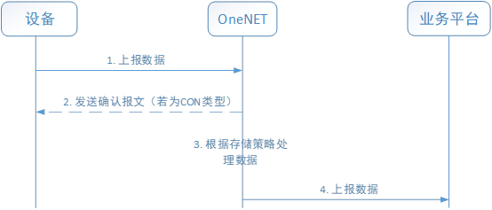

# OneNET-NBIoT-Kit用户指南

------

## 简介

OneNET推出的NB-IoT物联网套件为用户提供“终端-平台-应用”整体解决方案，帮助企业快速实现NB-IoT能力升级。

终端侧通过移植SDK可以实现基于轻量化的CoAP+LwM2M协议进行传输，降低物联网终端功耗。

主要面向基于蜂窝的窄带物联网（Narrow Band Internet of Things, NB-IoT）场景下物联网应用，聚焦于低功耗广覆盖（LPWA）物联网市场。具有覆盖广、连接多、速率低、成本低、功耗低、架构优等特点。

基于NB-IOT的LwM2M协议和CoAP协议实现UE与OneNET平台的通信，其中实现数据传输协议中传输层协议为CoAP，应用层协议LwM2M协议实现。

Coap协议有以下特点：

- 基于轻量级的UDP协议之上，具有重传机制。
- 协议支持IP多播。
- 协议包头小，仅为4个字节。
- 功耗低，适用于低功耗物联网场景。

LwM2M协议适用于轻量级的协议适用于各种物联网设备，LwM2M定义了三个逻辑实体:

- LwM2M Server 服务器；
- LwM2M Client 客户端，负责执行服务器的命令和上报执行结果；
- LwM2M 引导服务器 Bootstrap Server，负责配置LwM2M客户端。

## 目录结构

OneNET-NBIoT-Kit源代码目录结构如下表所示：

| 目录    | 说明                                |
| ------- | ----------------------------------- |
| ciscore | CoAP实现、LwM2M实现、主业务逻辑实现 |
| porting | 系统适配相关                        |
| sample  | 示例                                |

## 架构设计

### 架构

OneNET NB-IOT组件负责UE和平台间的交互。

协议栈结构如图1所示，包括了三部分的内容，最下层是基于UDP协议的CoAP实现，中间是基于CoAP的LwM2M协议实现，最上层是在LwM2M协议里面使用的IPSO定义的资源模型，用于对传感器以及传感器属性进行标识，该部分内容遵循IPSO组织制定的Profile规范。


​                                                   图1：协议栈结构

​		LwM2M协议架构如图2所示。


​                                                             图2：LwM2M协议架构

### 流程

cis_pump函数是整个组件的核心，负责几乎全部的逻辑处理。为保证对各平台的适应性，采用单一的状态机循环机制，UE从bootstrap、register、update以及各指令（read、write、exec、observe、notify、discover）均是通过不断的状态和数据链表轮询进行。

cis_pump逻辑主要分为①和②两部分，①主要为数据的主动上报逻辑，②为平台指令的被动接收执行，与外部的数据传递主要是通过几个链表和缓冲区进行。

逻辑①： 负责UE向平台的注册，且lifetime到期前进行update。

逻辑②： 负责执行平台下发的指令。Recv缓冲区负责缓存平台发送的数据，pump会不停的轮询			    缓冲区数据进行协议解析，然后交由用户线程进行指令的最终执行。并通过requestlist				和notifylist/observelist的查找比对，上报response或者数据。  

## 功能

### 设备接入

设备可以通过连接BootStrap或者直连NBIoT接入机接入。


1. Bootstrap接入：设备连接OneNET NBIoT套件的BootStrap地址，BootStrap服务器会根据设     备注册区域及负载将接入机地址分配给终端，终端根据该地址连接NBIoT接入机。
2. 接入机直连：设备选择一个平台提供的接入机直连地址进行连接。

### 订阅

可以在平台设置自动订阅（设备注册成功后，平台主动发起），也可以在平台手动订阅（通过页面订阅按钮，或者调用订阅API）。设备成功订阅后，设备可以主动上报数据。


1. IoT平台侧主动向终端设备发送订阅消息（Observe）来订阅设备资源列表中所有可观测的资源。
2. 终端设备接收到订阅消息后，检查需要订阅的资源是否可以被订阅且状态正常，如果是则返回订阅结果Success。
3. 订阅成功后，终端可以上报数据。

### 即时命令

在平台通过页面或者API对设备下发即时命令，若设备在线且核心网未老化，可成功下发。


1. 业务平台下发即时命令。
2. OneNET平台收到命令后立即下发命令到终端设备。
3. 终端设备发送命令响应消息。
4. OneNET平台将对应的响应命令转发到业务平台。

### 缓存命令

若设备离线，可通过调用API对设备下发缓存命令。缓存命令生效后，若设备有上行消息，则OneNET缓存命令服务会立即下发缓存命令。


1. 业务平台下发缓存命令。
2. OneNET收到命令后先将命令缓存到本地。
3. 待设备上线后，OneNET将缓存的命令下发到设备。
4. 设备发送命令响应消息。
5. OneNET将对应的响应命令转发到业务平台。

### 数据上报

平台支持NON类型和CON类型的数据上报方式。




1. 设备按照数据上报规则，上传携带订阅资源具体数值的Notify消息（即相应观测的传感器数据值），直到OneNET取消资源订阅。
2. OneNET接收到数据后根据配置的存储策略保存数据或者上报数据到业务平台。
3. OneNET将数据上报到业务平台。
4. OneNET发送确认消息给终端设备。

### 安全性

###### authcode鉴权码

​       用户可以在平台配置设备的authcode，设备注册时携带该authcode，可用于设备鉴权，防止设备被其他用户盗用，增加了设备的安全性。

###### DTLS安全连接

​       平台支持基于PSK(pri-sharedkey, 预置共享秘钥)的DTLS协议，在用户设备和OneNET之间建立安全通道，用于认证和数据安全传输。


1. 设备在OneNET注册时，平台随机生成一个PSK码作为预置共享密钥key
2. 设备与平台利用握手协议，通过发送带有Cookie值、密钥K等参数的消息相互认证
3. 建立安全通道，进行数据传输

## 使用说明

### 图形化配置

使用OneNET-NBIoT-Kit需要通过Menuconfig的图形化工具进行配置选择，配置的路径如下所示：

```
(Top) → Components → Cloud → OneNET → NB-IoT Kit
[*] Enable onenet nbiot-kit
[*]     Using nbiot-kit device auth code
(abcdefg)   Input device auth code
[*]     Enable onenet nbiot-kit log (NEW)
(3)         Log output level (NEW)
(200)       Log buffer size (NEW)
[*]     Enable onenet nbiot-kit memtrace
[*]     Enable onenet nbiot-kit sample (NEW)
```

进行OneNET-NBIoT-Kit选项配置需要先在Menuconfig中选中Enable onenet nbiot-kit，然后再进行其他的配置选择。

- Using nbiot-kit device auth code：是否打开auth code功能，对应OneNET平台的鉴权码。
- Input device auth code：用于输入设备鉴权码，对应OneNET平台的Auth_Code配置。
- Enable onenet nbiot-kit log：是否打开nbiot-kit日志。
- Log output level：日志输出级别。
- Log buffer size：日志buffer大小。
- Enable onenet nbiot-kit memtrace：是否打开动态内存跟踪功能。
- Enable onenet nbiot-kit sample：是否打开示例。

### API使用说明手册

[OneNET NBIoT Kit API使用说明手册](doc/onenet_lwm2m_api.md)

## 注意事项

#### 1. OneNET NBIoT Kit 组件未开源，如有需要请联系我们

