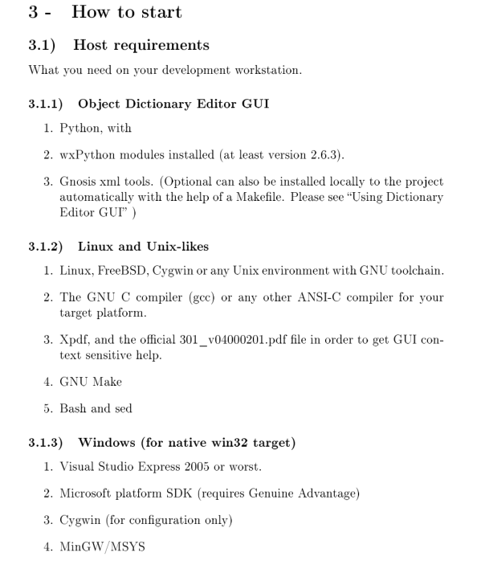
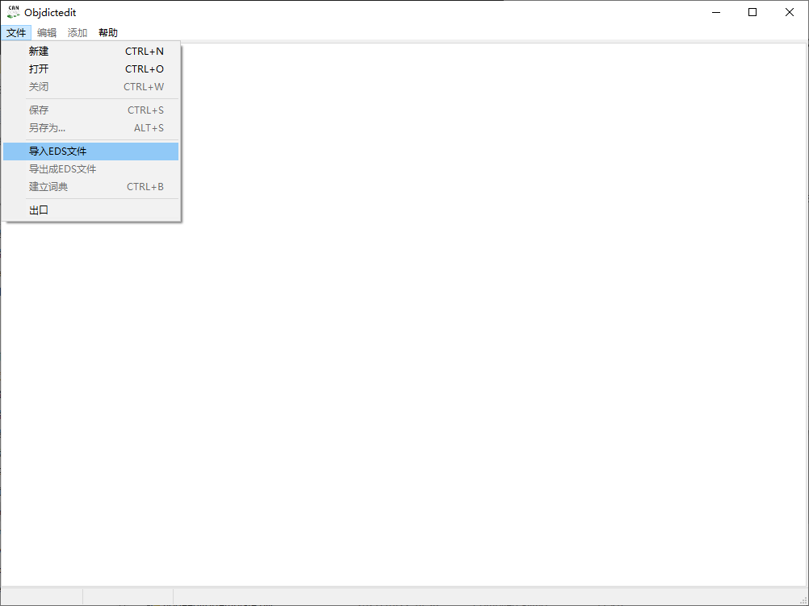

# CanFestival

# 简介

CanFestival是一个完全符合CIA DS-301 V402标准CANopen协议的开源(LGPL和GPL) CANopen框架协议栈源码，相较其他常用开源CANopen协议栈，CanFestival具有许多明显的优势：

- CanFestival为开发者提供了许多工具，以提高开发的便利性。例如用于生成节点对象字典源代码的对象字典编辑器，以及便于开发者自由配置编译选项的配置脚本。
- CanFestival能够运行于多种类型的平台。CanFestival源代码由ANSI-C编写，驱动和例程的编译情况仅取决于具体的编译工具。在目前最新的版本中，官方提供了对于多种硬件平台的驱动。此外，CanFestival可以在任意类Unix系统下编译和运行，如Linux和FreeBSD。
- CanFestival协议功能完整，完全符合CANopen标准。CanFestival完全支持2002年2月发布的CIA DS-301 V4.02标准，并支持CiA DS302中的简明DFC协议。

相关扩展：

CANopen是一种架构在控制局域网路（Controller Area Network, CAN）上的高层通讯协定，包括通讯子协定及设备子协定常在嵌入式系统中使用，也是工业控制常用到的一种现场总线。
CANopen 实现了OSI模型中的网络层以上（包括网络层）的协定。CANopen 标准包括寻址方案、数个小的通讯子协定及由设备子协定所定义的应用层。 CANopen 支持网络管理、设备监控及节点间的通讯，其中包括一个简易的传输层，可处理资料的分段传送及其组合。一般而言数据链结层及物理层会用CAN来实作。除了 CANopen 外，也有其他的通讯协定（如EtherCAT）实作 CANopen 的设备子协定。
CANopen由非营利组织CiA（CAN in Automation）进行标准的起草及审核工作，基本的 CANopen 设备及通讯子协定定义在 CAN in Automation (CiA) draft standard 301中。针对个别设备的子协定以 CiA 301 为基础再进行扩充。如针对 I/O 模组的 CiA401 及针对运动控制的 CiA402。

## 特性

- 工具：提供对象字典GUI图形化编辑器、代码生成，以及脚本等配套工具；

- 多平台：库源代码是ANSI标准C，支持多平台编译和开发；

- CANopen标准：支持DS-301、302、305等标准的CANOpen协议

  ------

## API介绍

### API列表

| 接口                     | 说明                                           |
| ------------------------ | ---------------------------------------------- |
| canopen_portopen         | 打开一个CAN设备                                |
| canopen_node_init        | 向指定CAN 挂载一个子节点                       |
| CanOpen_TimerInit        | 初始化CANopen 调度Timer                        |
| CanOpen_StartTimerLoop   | 启动CANopen 调度Timer                          |
| getNodeId                | 获取节点Id                                     |
| setNodeId                | 设置节点Id                                     |
| readNetworkDictCallback  | 主机读从机字典                                 |
| writeNetworkDictCallBack | 主机写从机字典                                 |
| masterSendNMTstateChange | 管理网络节点的状态，主站控制或切换从站节点状态 |

### API说明

#### canopen_portopen

该函数用于向打开一个CAN物理设备，其函数原型如下：

CAN_PORT canopen_portopen(s_BOARD *board)；

| 参数     | 说明                                    |
| -------- | --------------------------------------- |
| board    | busname can设备名，baudrate can通信速率 |
| 返回     | 说明                                    |
| CAN_PORT | device地址                              |

#### canopen_node_init

该函数用于向指定CAN 挂载一个子节点，其函数原型如下：

int canopen_node_init(CAN_PORT const canport, CO_Data *const d, const UNS8 node_id)；

| 参数    | 说明                  |
| ------- | --------------------- |
| canport | can device            |
| d       | 节点字典              |
| node_id | 节点号                |
| 返回    | 说明                  |
| int     | 挂载成功0，挂载失败-1 |

#### CanOpen_TimerInit

该函数用于初始化CANopen调度timer，其函数原型如下：

void CanOpen_TimerInit(void)；

| 参数 | 说明 |
| ---- | ---- |
| void | void |
| 返回 | 说明 |
| void | void |

#### CanOpen_StartTimerLoop

该函数用于启动CANopen调度timer；底层调用hrtimer实现，重复启动会被断言，其函数原型如下：

void CanOpen_StartTimerLoop(TimerCallback_t _init_callback)；

| 参数           | 说明                |
| -------------- | ------------------- |
| _init_callback | 未实现，传NULL 即可 |
| 返回           | 说明                |
| void           | 无                  |

#### getNodeId

该函数用于获取节点Id，其函数原型如下：UNS8 getNodeId(CO_Data* d)；

| 参数 | 说明     |
| ---- | -------- |
| d    | 节点字典 |
| 返回 | 说明     |
| UNS8 | 节点Id   |

#### setNodeId

该函数用于获取节点Id，其函数原型如下：void setNodeId(CO_Data* d, UNS8 nodeId)；

| 参数   | 说明       |
| ------ | ---------- |
| d      | 节点字典   |
| nodeId | 新的节点Id |
| 返回   | 说明       |
| void   | 无         |

#### **masterSendNMTstateChange**

该函数用于管理网络节点的状态，主站控制或切换从站节点状态；其函数原型如下：UNS8 masterSendNMTstateChange(CO_Data* d, UNS8 Node_ID, UNS8 cs)；

| 参数    | 说明                                                         |
| ------- | ------------------------------------------------------------ |
| d       | 节点字典                                                     |
| Node_ID | 节点Id                                                       |
| cs      | 节点状态                                                     |
|         | NMT_Start_Node                                0x01；启动节点 |
|         | NMT_Stop_Node                                0x02；停止节点  |
|         | NMT_Enter_PreOperational             0x80；预操作            |
|         | NMT_Reset_Node                              0x81；节点复位   |
|         | NMT_Reset_Comunication               0x82；通信复位          |
| 返回    | 说明                                                         |
| UNS8    | 错误码                                                       |

#### readNetworkDictCallback 

该函数用于通过字典数据读，其函数原型如下：UNS8 readNetworkDictCallback (CO_Data* d, UNS8 nodeId, UNS16 index, UNS8 subIndex, UNS8 dataType, SDOCallback_t Callback, UNS8 useBlockMode)；

| 参数         | 说明                         |
| ------------ | ---------------------------- |
| d            | 节点字典                     |
| nodeId       | 节点Id                       |
| index        | 主索引                       |
| subIndex     | 子索引                       |
| dataType     | 数据类型                     |
| Callback     | 回调                         |
| useBlockMode | 是否采用阻塞模式返回错误代码 |
| 返回         | 说明                         |
| UNS8         | 错误码                       |

#### writeNetworkDictCallBack 

该函数用于通过字典数据写，其函数原型如下：UNS8 writeNetworkDictCallBack (CO_Data* d, UNS8 nodeId, UNS16 index,

​    UNS8 subIndex, UNS32 count, UNS8 dataType, void *data, SDOCallback_t Callback, UNS8 useBlockMode)；

| 参数         | 说明                         |
| ------------ | ---------------------------- |
| d            | 节点字典                     |
| nodeId       | 节点Id                       |
| index        | 主索引                       |
| subIndex     | 子索引                       |
| count        | 数据大小                     |
| dataType     | 数据类型                     |
| data         | 待写入数据                   |
| Callback     | 回调                         |
| useBlockMode | 是否采用阻塞模式返回错误代码 |
| 返回         | 说明                         |
| UNS8         | 错误码                       |

## 附录

### 参考资料

《CANopen轻松入门》  广州致远电子股份有限公司

《CANopen high-level protocol for CAN-bus》

 CanFestival-3官方地址：https://hg.beremiz.org/CanFestival-3/

### **对象字典工具环境搭建**

这里的环境搭建可以参考Canfestival手册（manual_en.pdf）里面的指导，具体位置在3.1.1节：Object Dictionary Editor GUI.

## 

在安装目录下（默认路径：”C:\Program Files (x86)\Beremiz“）找到networkedit.py 双击执行即可打开对象字典编辑器如下：

#### 推荐环境软件版本

软件下载地址：https://hg.beremiz.org/

- Beremiz-1.1_RC5.exe
- python-2.7.10.msi
- wxPython2.8-win32-unicode-2.8.12.1-py27

