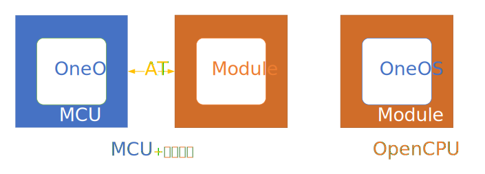
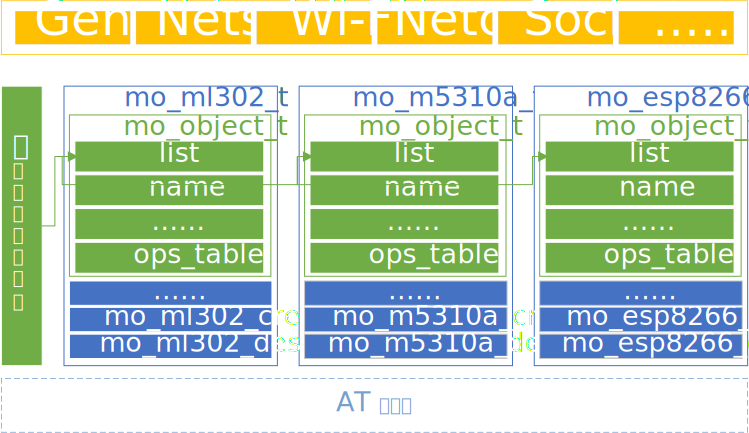
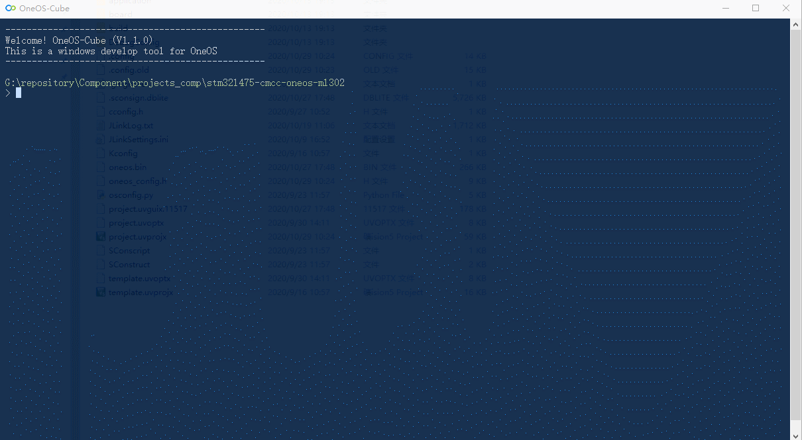

# Molink (Module link kit) - 模组连接套件

___

## 简介

通过网络连接实现设备之间的互联互通是物联网应用的核心，当前物联网设备普遍通过通信模组连接到网络中，通信模组在物联网应用中扮演着不可或缺的角色。由于物联网应用场景的需求各异，各个通信模组厂商都推出了许多针对不同应用场景的通信模组。虽然不同的通信模组均提供AT指令集供用户调用来控制通信模组，但是不同厂商、型号的通信模组AT指令集之间仍然存在许多不兼容的地方。这些不兼容的AT指令集给物联网应用的开发者带来了不便，也让物联网终端产品的通信模组优化升级十分困难。

Molink模组连接套件通过架构设计和模组适配实现了对不同的通信模组的统一控制，并向上层框架和应用提供统一的API接口，使开发者不必关心不同模组之间的差异即可完成网络相关应用的开发。



同时，OneOS OpenCPU模组方案完全兼容Molink API接口，通过统一的API接口实现MCU+模组和模组OpenCPU方案间应用代码的无缝迁移。

## 目录结构

Molink源代码目录结构如下表所示：

| 目录   | 说明                           |
| ------ | ------------------------------ |
| api    | 通用控制等接口的定义及高层实现 |
| core   | 模组对象管理及其他关键部分实现 |
| doc    | 文档                           |
| module | 基于不同型号的模组适配实现     |
| parser | 与模组进行AT指令通信的解析器   |
| tools  | Molink网络调试工具             |
| test   | Molink参考测试用例             |

Molink源代码按照软件架构进行层次划分，实现高内聚，低耦合，易于扩展和剪裁。

## 架构设计

Molink模组连接套件向上层框架和用户应用提供统一的API接口，同时适配了多种型号通信模组的AT指令集，架构如下图所示：



- 抽象接口层：提供通用控制、网络服务、网络连接、套接字、Wi-Fi管理等多种接口的定义及高层实现。
- 核心层：提供Molink模组对象定义、模组实例的管理及其他关键部分实现。
- 模组适配层：提供各种型号通信模组的抽象接口层各种接口的适配函数实现。
- AT解析器：可选模块，MCU架构下的模组适配通过AT解析器与通信模组进行AT指令通信。

## 模组支持

目前Molink已经适配支持的通信模组型号如下表所示：

|    厂商    |  类别   |    型号    |
| :--------: | :-----: | :--------: |
| 中移物联网 | 4G Cat1 |   ML302    |
|   广和通   | 4G Cat1 |    L610    |
|    有方    | 4G Cat1 |    N58     |
|  移远通信  | 4G Cat1 |   EC200x   |
|  移远通信  | 4G Cat1 |   EC600s   |
|   芯讯通   | 4G Cat1 |   A7600X   |
|   芯讯通   | 4G Cat1 |   A7670X   |
|   高新兴   | 4G Cat1 |   GM190    |
|    合宙    | 4G Cat1 |  AIR723UG  |
|    域格    | 4G Cat1 | CLM920-RV3 |
|  移远通信  | 4G Cat4 |    EC20    |
|   芯讯通   | 4G Cat4 | SIM7600ce  |
|   高新兴   | 4G Cat4 |   GM510    |
|   高新兴   | 4G Cat4 |  ME3630-W  |
| 中移物联网 | NB-IoT  |  M5310-A   |
| 中移物联网 | NB-IoT  |   M5311    |
|  移远通信  | NB-IoT  |    BC20    |
|  移远通信  | NB-IoT  |    BC26    |
|  移远通信  | NB-IoT  |    BC28    |
|  移远通信  | NB-IoT  |    BC95    |
|   利尔达   | NB-IoT  |    MB26    |
|   芯讯通   | NB-IoT  |   E7025    |
|   芯讯通   | NB-IoT  |  SIM7020   |
|   芯讯通   | NB-IoT  |  SIM7070x  |
|   高新兴   | NB-IoT  |   GM120    |
|   高新兴   | NB-IoT  |   ME3616   |
|    有方    | NB-IoT  |    N21     |
|    乐鑫    |  Wi-Fi  |  ESP8266   |
|    乐鑫    |  Wi-Fi  |   ESP32    |


## 使用说明

### 图形化配置

使用Molink需要通过Menuconfig的图形化工具进行配置选择，配置的路径如下所示：

```text
Top->Components->Network->Molink->
    [*] Enable IoT modules support
        Modules --->
            4G CAT1 Modules Support --->
                [ ] EC200X_600S
                [ ] ML302
                [ ] ......
            4G CAT4 Modules Support --->
                [ ] GM510
                [ ] EC20
                [ ] ......
            NB-IoT modules Support --->
                [ ] M5310A
                [ ] M5311
                [ ] BC95
                [ ] BC28
                [ ] ......
            WiFi Modules Support --->
                [ ] ESP8266
                [ ] ESP32
                [ ] ......
        Parser --->
            [*] Enable AT Parser
            (2048) The AT Parser task stack size
            [ ]    Enable print RAW format AT command communication data
```

进行Molink选项配置需要首先在Menuconfig中选中Enable IoT Modules support，然后再进行模组型号及其他的配置选择。

- Modules 子菜单下可以按模组的网络类别选择需要使用模组型号并进行配置，其中不同模组型号菜单选项略有差异，具体的选项功能可以参考菜单中显示的选项说明。
- Parser 子菜单下可以对AT解析器进行配置，若首先在Modules子菜单下选择了模组型号则AT解析器将会被自动关联选择，无需再手动配置。

下面以配置中移物联网ML302模组的选项为例进行说明，配置ML302模组的过程如下图所示：


ML302模组的配置菜单如下所示：

```text
[*] Enable ML302 Module Object Auto Create
(uart2) ML302 Interface Device Name (NEW)
(115200) ML302 Interface Device Rate (NEW)
(512)   The maximum length of AT command data accepted (NEW)
-*- Enable ML302 Module General Operates
-*- Enable ML302 Module Network Service Operates
[*] Enable ML302 Module Ping Operates
[*] Enable ML302 Module Ifconfig Operates
-*- Enable ML302 Module Network TCP/IP Operates
[*] Enable ML302 Module BSD Socket Operates
[ ] Enable ML302 Module MQTT Client Operates
```

- 自动创建模组实例，系统初始化时将自动调用ML302模组实例创建函数，将创建的ML302模组实例加入到模组实例管理链表中。
- ML302模组接口设备名称，对应OneOS设备驱动框架中ML302与系统相连的接口设备的名称，默认为uart2。
- ML302模组接口设备速率，对应ML302与系统相连的接口设备的速率，默认为115200。
- ML302模组中接收一行AT指令数据的最大长度，默认为512。
- 使能ML302通用控制操作，包括获取IMEI号码、获取ICCID号码等功能。
- 使能ML302网络服务操作，包括附着、注网、获取信号质量等功能。
- 使能ML302 Ping操作，包括通过Ping测试网络连接等功能。
- 使能ML302 Ifconfig操作，包括打印模组IMEI、IPv4地址、信号质量等的功能。
- 使能ML302 TCP/IP操作，包括基础的TCP/UDP连接的创建、连接、发送、接收、断开连接等的功能。
- 使能ML302 Socket套接字操作，在ML302 TCP/IP操作的基础封装套接字接口，提供部分套接字编程的接口。
- 使能ML302 MQTT客户端操作，包括客户端创建、销毁、连接、订阅、发布等接口。

关于各类接口详细的说明可以参考Molink API使用说明手册。

### API使用说明手册

[Molink API使用说明手册](./doc/molink_api.md)

## 注意事项

#### 1. 串口数据缓冲区大小配置

通信模组通过串口发送给系统的数据将会首先缓存在串口数据缓冲区中，因此，如果串口缓冲区大小设置过小则会导致Molink无法正确的接收通信模组发送的数据，造成AT指令执行超时或数据接收不全等问题。在OneOS操作系统中串口缓存区的大小默认为64bytes，如果使用Molink组件则建议将串口缓冲区大小设置为略大于通信所需的数据的最大值，例如：设置为1024bytes或2048bytes。

通过menuconfig设置串口缓冲区大小的过程如下图所示：


