# HTTP用户指导书

## 1.功能说明

HTTP协议是一种基于TCP/IP协议之上的应用层协议，B/S（浏览器/服务器）模式下主要运用在浏览器访问网站，而嵌入式操作系统则是采用的C/S（客户端/服务器）模式，通过在组件层将HTTP协议进行内部消息封装，提供上层的接口，供应用层调用。

## 2.使用环境

### 2.1硬件环境

目前所有单板都支持，但由于http组件运行，特别加密的情况下占用内存较大，所以建议http组件运行在内存较大的单板上。例如：

1、 stm32f407-atk-explorer

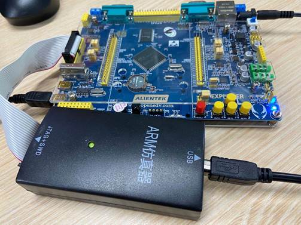

### 2.2软件环境

测试软件配置：

编译以来软件：

1. keil编译软件

2. 串口软件SecureCRT 8.3

3. scons配置软件

由于运行shell用例的栈内存默认是2048，太小了，会造成栈溢出，所以需要修改栈大小为7168，修改加密数据段的最大长度为16384。通过scons软件修改。

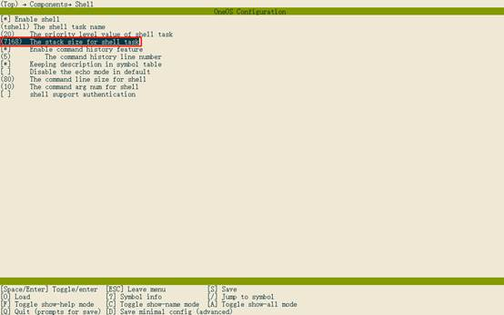

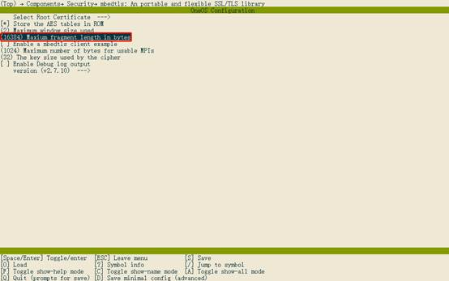

 

## 3.软件编译烧录

### 3.1生成软件工程

打开scons软件，运行脚本命令：scons –-target=mdk5 生成新的keil工程。

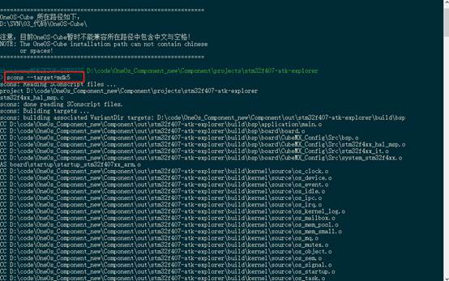

### 3.2编译软件

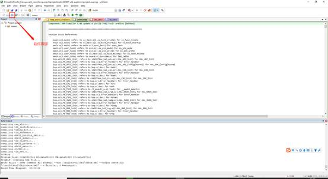

### 3.3软件烧录

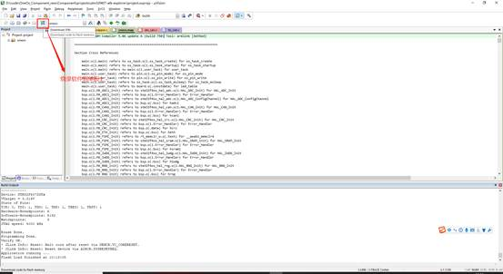

## 4.开始测试

### 4.1 通过串口连接软件连接单板

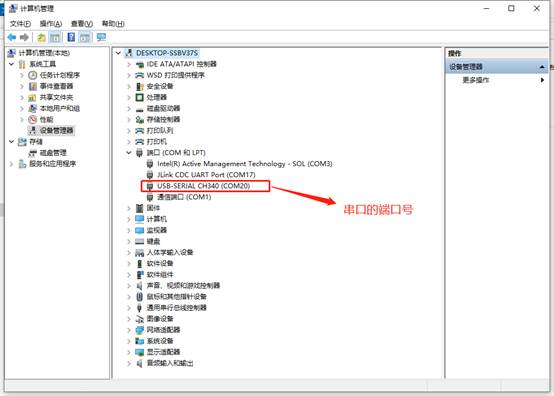

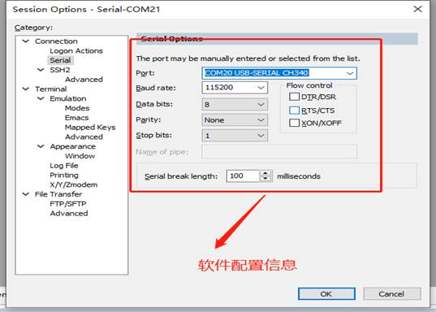

连接成功

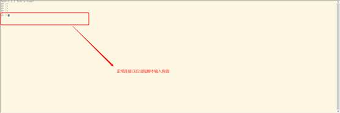

连接成功以后，键盘上按table键，出现系统测试用例命令

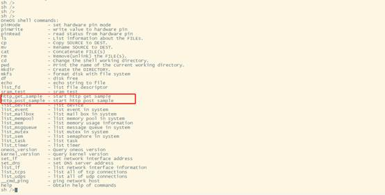

### 4.2 测试网络通信状态

测试命令：

```c
lwip_ping http://www.baidu.com
```

如果显示如下图所示说明通信正常，可以进行测试。

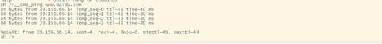

### 4.3 http加密get测试命令

```
http_get_sample 默认会访问url:https://open.iot.10086.cn/
```

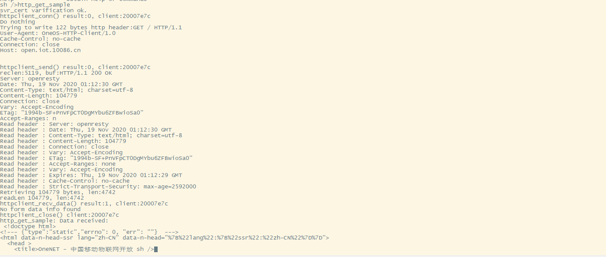

### 4.4 http 加密post测试命令!

  

```c
   http_post_sample 默认会访问url: https://10.15.17.39:28443/server/echo
```

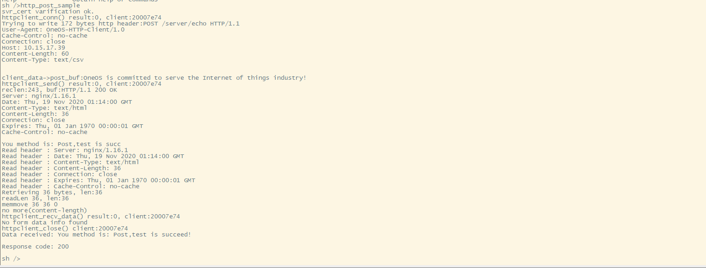

### 4.5 http非加密get测试命令

可以通过手动输入网址测试 http_get_sample+url,

例如：

```c
http_get_sample http://www.baidu.com/
```

​     

### 4.6 http非加密post测试命令

可以通过手动输入网址测试 http_post_sample+url：

​     例如：

```
http_post_sample http://121.89.166.244/server/echo
```

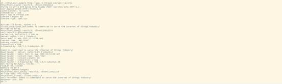

 