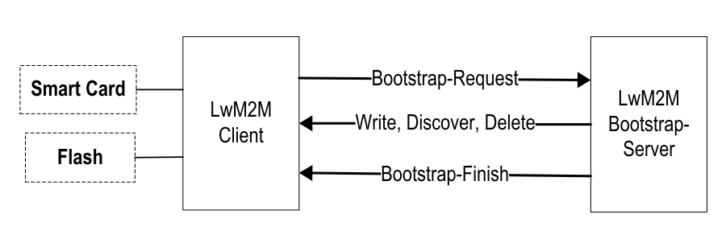
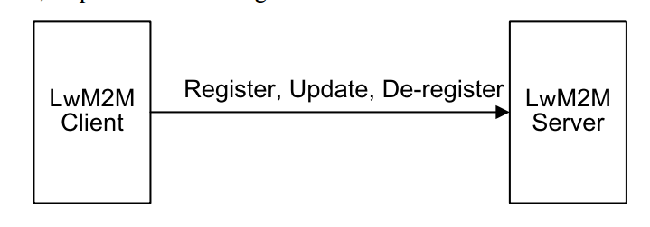
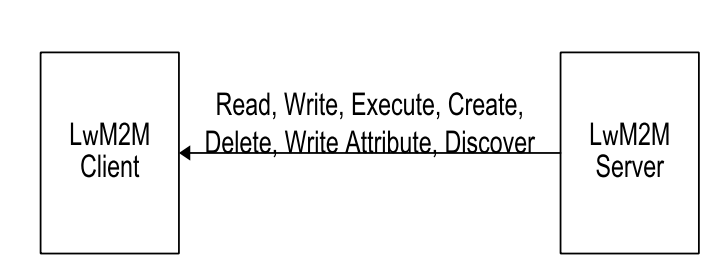
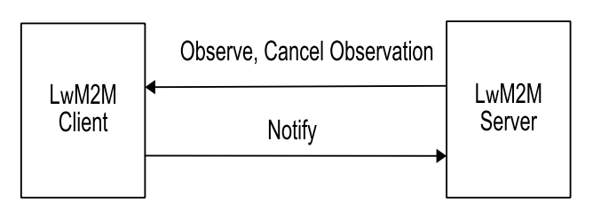
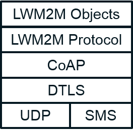

# lwm2m协议实现例程

## 简介

LwM2M全称lightweight Machine to Machine,是OMA（Open Moblile Alliance）定义的物联网协议，主要可以使用在资源受限（包括存储、功耗等）的嵌入式设备。这个协议基于CoAP（Constrained Application Protocol）协议，CoAP协议基于UDP协议，默认UDP端口号为5683。Eclipse Wakaama：基于C，提供了LwM2M服务器与LwM2M客户端的实现。

## lwm2m协议

lwm2m主要由3个设备（或者叫做逻辑实体）组成，分别为：客户端设备，引导服务器，工作服务器

- LWM2M Server 工作服务器
- LWM2M client 客户端 负责执行服务器的命令和上报执行结果
- LWM2M Bootstrap server 引导服务器 负责配置LWM2M客户端

可以理解为，首先有个设备，比如单板设备，算是LWM2M client 客户端设备，其次需要一个引导服务器 Bootstrap server，它是用来配置你的单板设备，还有一个Server 工作服务器。我这边理解是你的单板设备先去问问引导服务器，我应该去连那个工作服务器，然后再去连接工作服务器。

## lwm2m实现

1.Bootstrap 类似于引导程序

客户端有4个引导方式，其中后面两种需要LWM2M 引导服务器 Bootstrap server

- Factory Bootstrap
- Bootstrap from Smartcard
- Client Initiated Bootstrap
- Server Initiated Bootstrap

看如下解释The LwM2M Bootstrap-Server is used to provision the LwM2M Client with the information required to contact the LwM2M Server(s).说白了引导服务器就是告诉客户端去连接哪个工作服务器的。

其中Client Initiated Bootstrap这种引导方式，需要客户端发送一个Bootstrap-Request，第4种方式不需要


2.这3个逻辑实体之间有4组通信的交互

Device Discovery and Registration，这是客户端和工作服务器之间的注册接口
这个接口让客户端注册到服务器并通知服务器客户端所支持的能力（简单说就是支持哪些资源Resource和对象Object）

Bootstrap，这是客户端和引导服务器之间的通信接口
Bootstrap server通过这个接口来配置Clinet - 比如说LWM2M server的URL地址

Device Management and Service Enablement，这是客户端和工作服务器之间的设备管理接口
这个就是最主要的业务接口了。 LWM2M Server 发送指令给 Client 并受到回应。

Information Reporting，这是客户端和工作服务器之间的上报接口
这个接口是 LWM2M Client 来上报其资源信息的，比如传感器温度。上报方式可以是事件触发，也可以是周期性的。

3.客户端和引导服务器之间的通信接口



4.客户端和工作服务器之间的注册接口



5.客户端和工作服务器之间的设备管理接口



6.客户端和工作服务器之间的上报接口




7.lwm2m协议栈



### 硬件说明

本例程需要依赖 IoTBoard 板上的网络通信模组完成网络通信，因此请确保硬件平台上的 WiFi 模组或者4G模组或者以太网其中一项能正常通信。再进行lwm2m相关的业务。

### 软件说明

LwM2M协议定义了一个以资源（Resource）为基本单位的模型，每个资源可以携带数值，可以指向地址，以表示LwM2M客户端中每一项可用的信息。资源都存在于对象实例中（Object Instance），即对象（Object）的实例化。LwM2M协议预定义了8种对象（Object）来满足基本的需求，分别是：LwM2M协议定义了一个以资源（Resource）为基本单位的模型，每个资源可以携带数值，可以指向地址，以表示LwM2M客户端中每一项可用的信息。资源都存在于对象实例中（Object Instance），即对象（Object）的实例化。LwM2M协议预定义了8种对象（Object）来满足基本的需求，分别是：

| Object                                    | Object ID |
| ----------------------------------------- | :-------: |
| Security（安全对象）                      |     0     |
| Server（服务器对象）                      |     1     |
| Access Control（访问控制对象）            |     2     |
| Device（设备对象）                        |     3     |
| Connectivity Monitoring（连通性监控对象） |     4     |
| Firmware（固件对象）                      |     5     |
| Location（位置对象）                      |     6     |
| Connectivity Statistics（连通性统计对象） |     7     |

协议栈提供的主要API

**内存管理类API**

```c
void * lwm2m_malloc(size_t s);
void * lwm2m_free(void * p);
char * lwm2m_strdup(const char * str);
int lwm2m_strncmp(const char * s1, const char * s2, size_t n);
```

第三个函数作用是产生一个能放入str的内存空间，并将str的内容复制（duplicate）其中。

**时间管理类API**

```c
time_t lwm2m_gettime(void);
```

返回距离上一次调用该函数时所流逝（elapse）的时间。根据POSIX规范，time_t是一个有符号整数。错误时返回负数。

**链表操作类API**

```c
typedef struct _lwm2m_list_t
{
  struct _lwm2m_list_t * next;
  uint16_t   id;
} lwm2m_list_t;

lwm2m_list_t * lwm2m_list_add(lwm2m_list_t * head, lwm2m_list_t * node);
lwm2m_list_t * lwm2m_list_find(lwm2m_list_t * head, uint16_t id);
lwm2m_list_t * lwm2m_list_remove(lwm2m_list_t * head, uint16_t id, lwm2m_list_t ** nodeP);
uint16_t lwm2m_list_newId(lwm2m_list_t * head);
void lwm2m_list_free(lwm2m_list_t * head);

#define LWM2M_LIST_ADD(H,N) lwm2m_list_add((lwm2m_list_t *)H, (lwm2m_list_t *)N);
#define LWM2M_LIST_RM(H,I,N) lwm2m_list_remove((lwm2m_list_t *)H, I, (lwm2m_list_t **)N);
#define LWM2M_LIST_FIND(H,I) lwm2m_list_find((lwm2m_list_t *)H, I)
#define LWM2M_LIST_FREE(H) lwm2m_list_free((lwm2m_list_t *)H)


```

lwm2m_list_newId函数返回指定链表内未被使用的最小id。

lwm2m_list_newId函数返回指定链表内未被使用的最小id。

lwm2m_list_free函数工作方式是：仅对每个节点调用lwm2m_free。

**URI类API**
对于LWM2M实体（比如一个支持LWM2M协议的设备），可访问服务被抽象为一个一个对象，每一个对象局有三种层次，分别是：Object，Object-Instance，Resource。举例来说，一个LWM2M实体上包含若干提供不同功能的对象（比如说若干种不同的传感器），而每一种功能有可能由多个对象实例提供（比如多个温度传感器，都提供温度读取的功能），这些对象实例实际所能完成的功能被称为资源。（比如温度传感器提供的数据，摄像机拍摄的影像等）。每一个层次在对应的层级上有着独立的ID，分别称为Object ID，Object Instance ID，Resource ID。OMA定义了一些标准的ID，例如：Object ID中的LWM2M_SECURITY_OBJECT_ID为0，这一对象用于为节点间的通信提供安全功能。 而security object对象中包含一些标准化的资源，比如，LWM2M_PUBLIC_KEY_ID标识了security object中的公钥资源。Object Instance ID主要用于唯一标识不同的对象实例，一般来说是在设备启动和对象实例化的时候，动态分配（依次从0增长，每一种对象有着不同的实例ID序列）的。

通过URI访问LwM2M实体，合法URI格式  /<object id>[/ ][/]

```c
#define LWM2M_MAX_ID  ((uint16_t)0xFFFF)
#define LWM2M_URI_FLAG_OBJECT_ID   (uint8_t)0x04
#define LWM2M_URI_FLAG_INSTANCE_ID  (uint8_t)0x02
#define LWM2M_URI_FLAG_RESOURCE_ID  (uint8_t)0x01

#define LWM2M_URI_IS_SET_INSTANCE(uri) (((uri)->flag & LWM2M_URI_FLAG_INSTANCE_ID) != 0)
#define LWM2M_URI_IS_SET_RESOURCE(uri) (((uri)->flag & LWM2M_URI_FLAG_RESOURCE_ID) != 0)

typedef struct
{
  uint8_t    flag;      // indicates which segments are set
  uint16_t   objectId;
  uint16_t   instanceId;
  uint16_t   resourceId;
} lwm2m_uri_t;

#define LWM2M_STRING_ID_MAX_LEN    6

// Parse an URI in LWM2M format and fill the lwm2m_uri_t.
// Return the number of characters read from buffer or 0 in case of error.
// Valid URIs: /1, /1/, /1/2, /1/2/, /1/2/3
// Invalid URIs: /, //, //2, /1//, /1//3, /1/2/3/, /1/2/3/4
int lwm2m_stringToUri(const char * buffer, size_t buffer_len, lwm2m_uri_t * uriP);
```

lwm2m.h通过lwm2m_stringToUri函数，来将URI字符串转化为lwm2m_uri_t结构。我们可以通过两个预定义的宏LWM2M_URI_IS_SET_INSTANCE和LWM2M_URI_IS_SET_RESOURCE来判断URI中后两个ID是否被设置。

**数据类API**
协议栈定义了一种标准的数据类型lwm2m_data_t，用于存储各种协议中可能用到的数据。

```c
typedef enum
{
  LWM2M_TYPE_UNDEFINED = 0,
  LWM2M_TYPE_OBJECT,
  LWM2M_TYPE_OBJECT_INSTANCE,
  LWM2M_TYPE_MULTIPLE_RESOURCE,
  LWM2M_TYPE_STRING,
  LWM2M_TYPE_OPAQUE,
  LWM2M_TYPE_INTEGER,
  LWM2M_TYPE_FLOAT,
  LWM2M_TYPE_BOOLEAN,
  LWM2M_TYPE_OBJECT_LINK
} lwm2m_data_type_t;

typedef struct _lwm2m_data_t lwm2m_data_t;

struct _lwm2m_data_t
{
  lwm2m_data_type_t type;
  uint16_t   id;
  union
  {
    bool     asBoolean;
    int64_t   asInteger;
    double    asFloat;
    struct
    {
      size_t   length;
      uint8_t * buffer;
    } asBuffer;
    struct
    {
      size_t     count;
      lwm2m_data_t * array;
    } asChildren;
    struct
    {
      uint16_t objectId;
      uint16_t objectInstanceId;
    } asObjLink;
  } value;
};
```

数据类型与成员的对应关系
LWM2M_TYPE_OBJECT,LWM2M_TYPE_OBJECT_INSTANCE, LWM2M_TYPE_MULTIPLE_RESOURCE:value.asChildren
LWM2M_TYPE_STRING, LWM2M_TYPE_OPAQUE: value.asBuffer
LWM2M_TYPE_INTEGER,LWM2M_TYPE_TIME: value.asInteger
LWM2M_TYPE_FLOAT: value.asFloat
LWM2M_TYPE_BOOLEAN: value.asBoolean

在LWM2M中，你可以将opaque理解为约定了特殊结构的buffer，只需要知道它的使用方式即可。

```c
typedef enum
{
  LWM2M_CONTENT_TEXT    = 0,     // Also used as undefined
  LWM2M_CONTENT_LINK    = 40,
  LWM2M_CONTENT_OPAQUE   = 42,
  LWM2M_CONTENT_TLV    = 11542,
  LWM2M_CONTENT_JSON    = 11543
} lwm2m_media_type_t;
```

```c
lwm2m_data_t * lwm2m_data_new(int size);
int lwm2m_data_parse(lwm2m_uri_t * uriP, uint8_t * buffer, size_t bufferLen, lwm2m_media_type_t format, lwm2m_data_t ** dataP);
size_t lwm2m_data_serialize(lwm2m_uri_t * uriP, int size, lwm2m_data_t * dataP, lwm2m_media_type_t * formatP, uint8_t ** bufferP);
void lwm2m_data_free(int size, lwm2m_data_t * dataP);

void lwm2m_data_encode_string(const char * string, lwm2m_data_t * dataP);
void lwm2m_data_encode_nstring(const char * string, size_t length, lwm2m_data_t * dataP);
void lwm2m_data_encode_opaque(uint8_t * buffer, size_t length, lwm2m_data_t * dataP);
void lwm2m_data_encode_int(int64_t value, lwm2m_data_t * dataP);
int lwm2m_data_decode_int(const lwm2m_data_t * dataP, int64_t * valueP);
void lwm2m_data_encode_float(double value, lwm2m_data_t * dataP);
int lwm2m_data_decode_float(const lwm2m_data_t * dataP, double * valueP);
void lwm2m_data_encode_bool(bool value, lwm2m_data_t * dataP);
int lwm2m_data_decode_bool(const lwm2m_data_t * dataP, bool * valueP);
void lwm2m_data_encode_objlink(uint16_t objectId, uint16_t objectInstanceId, lwm2m_data_t * dataP);
void lwm2m_data_encode_instances(lwm2m_data_t * subDataP, size_t count, lwm2m_data_t * dataP);
void lwm2m_data_include(lwm2m_data_t * subDataP, size_t count, lwm2m_data_t * dataP);
```

lwm2m_data_parse 将buffer中的数据根据formatP转化并dataPc
lwm2m_data_serialize 将dataP中的数据根据formatP序列化并填入buffer
encode类函数 将特定数据类型的数据编码并填入dataP
decode类函数 从dataP中以特定数据类型提取数据并填入对应指针位置

**LWM2M运行环境**
所谓运行环境，通常包含了一系列运行时需要的数据和操作。表现在具体的代码实现中，则是一个包含了若干成员变量和函数的结构体。在wakaama中，这个运行时环境被实现为一个名为lwm2m_context_t的结构体，该结构体抽象了一个正在运行的服务器、客户端或者启动服务器的实体。

```c
typedef struct
{
#ifdef LWM2M_CLIENT_MODE
  lwm2m_client_state_t state;
  char *        endpointName;
  char *        msisdn;
  char *        altPath;
  lwm2m_server_t *   bootstrapServerList;
  lwm2m_server_t *   serverList;
  lwm2m_object_t *   objectList;
  lwm2m_observed_t *  observedList;
#endif
#ifdef LWM2M_SERVER_MODE
  lwm2m_client_t *     clientList;
  lwm2m_result_callback_t monitorCallback;
  void *          monitorUserData;
#endif
#ifdef LWM2M_BOOTSTRAP_SERVER_MODE
  lwm2m_bootstrap_callback_t bootstrapCallback;
  void *           bootstrapUserData;
#endif
  uint16_t         nextMID;
  lwm2m_transaction_t *  transactionList;
  void *          userData;
} lwm2m_context_t;
```

### lwm2m_object_t

LWM2M实体（以下简称“实体”）被抽象为提供若干功能的对象，每一个对象被分为三个层次：分别为LWM2M对象，对象实例，绑定于对应实例的资源。

因此，我们为了定位对应的资源（通过URI），需要提供至少三个参数（还会有一些额外的参数，后文再行讨论）：Object ID，Object Instance ID和Resource ID。所以，通常情况下 ，我们访问一个资源的URI长成这个样子：/0/1/2。但是，定位了资源，我们还需要通过特定的方法（通常对应一个或一组对应的函数）来操作这些资源。LWM2M定义了一系列标准方法来操作这些资源，这些方法包括：read、write、discover、create、delete、execute。对于特定的标准对象，LWM2M协议文档规定了每种方法的响应流程，但是对于自定义的对象，我们可以自行约定这些方法的响应方式，也可以只实现其中的任意种方法。

总结来说，lwm2m_object_t抽象了客户端实体中的资源。

typedef struct _lwm2m_object_t lwm2m_object_t;

```c
struct _lwm2m_object_t
{
  struct _lwm2m_object_t * next;      // for internal use only.
  uint16_t    objID;
  lwm2m_list_t * instanceList;
  lwm2m_read_callback_t   readFunc;
  lwm2m_write_callback_t   writeFunc;
  lwm2m_execute_callback_t  executeFunc;
  lwm2m_create_callback_t  createFunc;
  lwm2m_delete_callback_t  deleteFunc;
  lwm2m_discover_callback_t discoverFunc;
  void * userData;
};
```

objID 标识当前对象的ID，也就是Object ID
instanceList 是对象实例的列表，列表和节点类型参看辅助类功能API一节
6个事件回调函数（callback）,在对象收到对应方法请求时被调用
userData 是用户自定义的数据，可以存储任意类型和大小数据的指针，一般是跟该对象密切相关的信息（例如配置信息等）

回调函数：

```c
typedef uint8_t (*lwm2m_read_callback_t) (uint16_t instanceId, int * numDataP, lwm2m_data_t ** dataArrayP, lwm2m_object_t * objectP);
typedef uint8_t (*lwm2m_discover_callback_t) (uint16_t instanceId, int * numDataP, lwm2m_data_t ** dataArrayP, lwm2m_object_t * objectP);
typedef uint8_t (*lwm2m_write_callback_t) (uint16_t instanceId, int numData, lwm2m_data_t * dataArray, lwm2m_object_t * objectP);
typedef uint8_t (*lwm2m_execute_callback_t) (uint16_t instanceId, uint16_t resourceId, uint8_t * buffer, int length, lwm2m_object_t * objectP);
typedef uint8_t (*lwm2m_create_callback_t) (uint16_t instanceId, int numData, lwm2m_data_t * dataArray, lwm2m_object_t * objectP);
typedef uint8_t (*lwm2m_delete_callback_t) (uint16_t instanceId, lwm2m_object_t * objectP);
```

这些回调函数根据命名，分别作为实体接收到对应的方法的请求后，所触发的动作入口（类似于中断处理器或者事件句柄）。需要注意的是，这里定义的实际上是函数类型，需要将对应的函数声明为上述类型才可以使用。

### lwm2m_observed_t

记录客户端实体中被服务器观察（监听）的资源（事件）。

```c
typedef struct _lwm2m_watcher_
{
  struct _lwm2m_watcher_ * next;
  bool active;
  bool update;
  lwm2m_server_t * server;
  lwm2m_attributes_t * parameters;
  uint8_t token[8];
  size_t tokenLen;
  time_t lastTime;
  uint32_t counter;
  uint16_t lastMid;
  union
  {
    int64_t asInteger;
    double  asFloat;
  } lastValue;
} lwm2m_watcher_t;
typedef struct _lwm2m_observed_
{
  struct _lwm2m_observed_ * next;
  lwm2m_uri_t uri;
  lwm2m_watcher_t * watcherList;
} lwm2m_observed_t;
```

lwm2m_watcher_t      代表了观察者的相关信息；

lwm2m_observed_t中uri  表示观察的资源URI，watcherList是观察该资源的观察者列表。

### lwm2m_client_t

该结构体描述了远端客户端的基本信息。

```c
typedef struct _lwm2m_client_object_
{
  struct _lwm2m_client_object_ * next; // matches lwm2m_list_t::next
  uint16_t         id;     // matches lwm2m_list_t::id
  lwm2m_list_t *      instanceList;
} lwm2m_client_object_t;

typedef struct _lwm2m_observation_
{
  struct _lwm2m_observation_ * next;  // matches lwm2m_list_t::next
  uint16_t           id;   // matches lwm2m_list_t::id
  struct _lwm2m_client_ * clientP;
  lwm2m_uri_t       uri;
  lwm2m_status_t      status;
  lwm2m_result_callback_t callback;
  void *          userData;
} lwm2m_observation_t;

typedef struct _lwm2m_client_
{
  struct _lwm2m_client_ * next;    // matches lwm2m_list_t::next
  uint16_t         internalID; // matches lwm2m_list_t::id
  char *          name;
  lwm2m_binding_t     binding;
  char *          msisdn;
  char *          altPath;
  bool           supportJSON;
  uint32_t         lifetime;
  time_t          endOfLife;
  void *          sessionH;
  lwm2m_client_object_t * objectList;
  lwm2m_observation_t *  observationList;
} lwm2m_client_t;
```

注意将lwm2m_observation_t和lwm2m_observed_t这两个结构体区分开，前者用于在服务器端中记录对应客户端资源的观察情况，而后者则恰恰相反，用于在客户端中记录被服务器观察的资源。
sessionH成员是客户端和服务器的会话记录，在示例程序中是一个connection_t类型。

### lwm2m_server_t

这个结构体描述了*远端*服务器实体，注意，这个结构体应当只被客户端实体用来记录远端服务器的信息。

```c
typedef struct _lwm2m_server_
{
  struct _lwm2m_server_ * next;     // matches lwm2m_list_t::next
  uint16_t         secObjInstID; // matches lwm2m_list_t::id
  uint16_t         shortID;    // servers short ID, may be 0 for bootstrap server
  time_t          lifetime;   // lifetime of the registration in sec or 0 if default value (86400 sec), also used as hold off time for bootstrap servers
  time_t          registration; // date of the last registration in sec or end of client hold off time for bootstrap servers
  lwm2m_binding_t     binding;    // client connection mode with this server
  void *          sessionH;
  lwm2m_status_t      status;
  char *          location;
  bool           dirty;
  lwm2m_block1_data_t *  block1Data;  // buffer to handle block1 data, should be replace by a list to support several block1 transfer by server.
} lwm2m_server_t;
```


lwm2m_binding_t和lwm2m_status_t分别记录了与该服务器的通信方式（例如UDP、SMS等）和与该服务器的通信状态（是否正在注册过程中等）。

void * session记录了与该服务器通信的会话信息，在示例程序中是connection_t类型。


下面主要叙述lwm2m客户端程序的创建流程、工作方式和基本操作，具体的实现可以参照wakaama的lightclient示例程序。注意，wakaama本身并不参与具体的底层通信的实现，也就是说，你需要自己去实现udp通信或者其他通信。

**初始化**

```c
// initialize a liblwm2m context.
lwm2m_context_t * lwm2m_init(void * userData);
// close a liblwm2m context.
void lwm2m_close(lwm2m_context_t * contextP);

**协议栈内部相关
```

```c
// perform any required pending operation and adjust timeoutP to the maximal time interval to wait in seconds.
int lwm2m_step(lwm2m_context_t * contextP, time_t * timeoutP);
// dispatch received data to liblwm2m
void lwm2m_handle_packet(lwm2m_context_t * contextP, uint8_t * buffer, int length, void * fromSessionH);
```


这一部分不包含内部通信

```c
// perform any required pending operation and adjust timeoutP to the maximal time interval to wait in seconds.
int lwm2m_step(lwm2m_context_t * contextP, time_t * timeoutP);
// dispatch received data to liblwm2m
void lwm2m_handle_packet(lwm2m_context_t * contextP, uint8_t * buffer, int length, void * fromSessionH);
```


这一部分不包含内部通信

**客户端函数**

```c
// configure the client side with the Endpoint Name, binding, MSISDN (can be nil), alternative path
// for objects (can be nil) and a list of objects.
// LWM2M Security Object (ID 0) must be present with either a bootstrap server or a LWM2M server and
// its matching LWM2M Server Object (ID 1) instance
int lwm2m_configure(lwm2m_context_t * contextP, const char * endpointName, const char * msisdn, const char * altPath, uint16_t numObject, lwm2m_object_t * objectList[]);
int lwm2m_add_object(lwm2m_context_t * contextP, lwm2m_object_t * objectP);
int lwm2m_remove_object(lwm2m_context_t * contextP, uint16_t id);
// send a registration update to the server specified by the server short identifier
// or all if the ID is 0.
// If withObjects is true, the registration update contains the object list.
int lwm2m_update_registration(lwm2m_context_t * contextP, uint16_t shortServerID, bool withObjects);
void lwm2m_resource_value_changed(lwm2m_context_t * contextP, lwm2m_uri_t * uriP);
```

**如何创建客户端程序**

首先我们需要调用lwm2m_init来创建客户端运行环境：

```c
lwm2m_context_t *client;
client = lwm2m_init(&userdata);
```


userdata可以是任意用户自定义的数据结构，它将被存储在lwm2m_context_t的userdata字段中。

然后调用lwm2m_configure来对客户端运行环境进行配置：

```c
char *name = "end point name"
lwm2m_object objArr[objCount] = {...};
result = lwm2m_configure(client, name, NULL, NULL, objCount, &objArr);
```

第一个参数是运行环境本身，第二个参数是终端节点名称，objCount指明了数组objArr的长度，objArr存储了该终端节点所含有的对象。

以上就完成了客户端节点的初始化工作，之后我们主需要编写客户端程序的主循环。
每次循环开始时，我们需要先让协议栈处理一些内部事务（比如发送或重发一些数据包）：

```c
struct timeval tv;
result = lwm2m_step(lwm2mH, &(tv.tv_sec));
```

result小于0时说明发生致命错误。
lwm2m_step的第二个参数是超时选项，默认是60秒。

然后通过套接字读取网络通信数据，并将数据使用lwm2m_handle_packet函数将数据交给协议栈进行处理即可：

```c
result = select(nfds, &rfds, NULL, NULL, &(tv));
if (result > 0) {
 nbytes = recvfrom(lfd, buffer, sizeof(buffer), (struct sockaddr *)&remote, &socklen);
 if (nbytes > 0) {
  lwm2m_handle_packet(client, buffer, nbytes, connP);
 }
}
```

connP是与该远端服务器通信用的会话实体，在wakaama的示例程序中，是connection_t类型

objID 标识当前对象的ID，也就是Object ID
instanceList 是对象实例的列表，列表和节点类型参看辅助类功能API一节
6个事件回调函数（callback）,在对象收到对应方法请求时被调用
userData 是用户自定义的数据，可以存储任意类型和大小数据的指针，一般是跟该对象密切相关的信息（例如配置信息等）