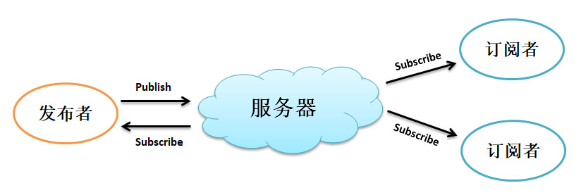

# Paho MQTT用户指南

------

## 简介

MQTT组件是Eclipse Paho MQTT Embedded C源码包（pahomqtt-v1.1.0）在OneOS操作系统的适配与开发。

MQTT（Message Queuing Telemetry Transport，消息队列遥测传输协议），是一种基于发布/订阅模式的“轻量级”通讯协议，该协议构建于TCP/IP协议上，由IBM在1999年发布。MQTT最大优点在于，可以以极少的代码和有限的带宽，为连接远程设备提供实时可靠的消息服务。做为一种低开销、低带宽占用的即时通讯协议，使其在物联网、小型设备、移动应用等方面有较广泛的应用。

MQTT组件为用户实现了客户端连接与断开、主题订阅与退订、消息发布、消息接收及回调、心跳维护等功能。



​                                                                    MQTT发布订阅模型

## 目录结构

MQTT 源代码目录结构如下表所示：

| 目录                     | 说明             |
| ------------------------ | ---------------- |
| MQTTPacket/src           | MQTT协议报文实现 |
| MQTTClient-OneOS/src     | MQTT客户端实现   |
| MQTTClient-OneOS/samples | 示例             |

## 使用说明

### 图形化配置

使用MQTT需要通过Menuconfig的图形化工具进行配置选择，配置的路径如下所示：

```
(Top) → Components→ Network→ Protocols→ MQTT→ pahomqtt-v1.1.0
[*] Enable Paho MQTT
[*]     Enable Paho MQTT Client
[ ]         Enable Paho MQTT TLS encrypt
[*]         Enable Paho MQTT sample
```

进行MQTT选项配置需要先在Menuconfig中选中Enable Paho MQTT，然后再进行其他的配置选择。

- Enable Paho MQTT Client：使能Paho MQTT客户端，当只使能Paho MQTT时，只包含MQTT各报文类型的协议层实现。
- Enable Paho MQTT TLS Encrypt：使能Paho MQTT的加密连接。
- Enable Paho MQTT sample：使能Paho MQTT示例。

### API使用说明手册

[Paho MQTT API使用说明手册](doc/pahomqtt_api.md)

## 注意事项

#### 1. 关闭MQTT加密

选择MQTT加密功能后会自动勾选mbedtls组件，当用户反向取消MQTT加密功能时记得手动关闭mbedtls组件。