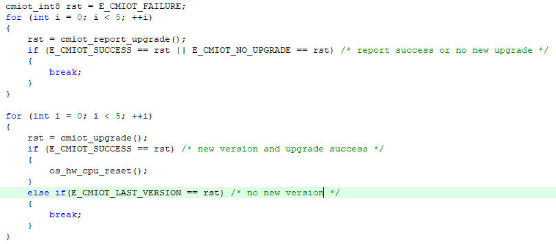

# **远程升级组件**

## **目录**
  
- [**远程升级组件**](#远程升级组件)
  - [**目录**](#目录)
  - [**简介**](#简介)
  - [**API介绍**](#api介绍)
  - [**配置选项**](#配置选项)
  - [**应用示例**](#应用示例)
  - [**FAQ**](#faq)

## **简介**

远程升级（Firmware Over The Air）可通过无线网络实现固件升级。OneOS的OTA为差分升级，采用此方式可极大降低升级包的大小。OneOS OTA组件分两部分：BootLoader和App，BootLoader实现固件还原功能、升级功能，App部分完成更新检测、固件下载、版本校验。


BootLoader获取方式：加入官方开发者交流QQ群158631242，由技术支持来提供。


**下载协议所有板子目前都可支持，列举部分板子差分算法的支持情况**（RAM > 200k，可以考虑使用Wosun；RAM > 512k，可以考虑使用Wosun high）：

**注1：如果使用串口通信，buffer推荐设置成512或更大，以免下载升级包出错**

STM32F091：支持LUSUN。

STM32F103：支持LUSUN。 

STM32F407：支持LUSUN。

STM32F429：支持LUSUN。

STM32F469：支持LUSUN。

STM32F769：支持LUSUN。

STM32F767：支持LUSUN。

STM32L475：支持LUSUN。

STM32F496：支持LUSUN。


## **API介绍**

**API列表**

无需调用表示：该接口无需OTA使用人员主动调用，OTA在需要的时候会自动调用，使用者只用根据自己的需求来重写。

| **接口**               | **说明**                                                     |
| :--------------------- | :----------------------------------------------------------- |
| cmiot_get_network_type | OTA组件使用的通信网络类型，用于在服务端显示，目前可保持默认值，无需调用 |
| cmiot_get_try_time     | OTA组件socket的接收超时时间，单位毫秒，无需调用              |
| cmiot_get_try_count    | OTA组件在解码服务器的数据失败时，或端侧处理失败时，重新向服务器请求的次数，无需调用 |
| cmiot_get_utc_time     | 当前的UTC时间戳，暂时未用到，目前可保持默认值，无需调用      |
| cmiot_get_uniqueid     | 端侧的MID，最大30字节，无需调用                              |
| cmiot_app_name         | APP分区的名字，无需调用                                      |
| cmiot_download_name    | DOWNLOAD分区的名字，无需调用                                 |
| cmiot_printf           | OTA组件日志输出接口，当前默认用ONEOS内核的日志输出接口，用户可更改，无需调用 |
| cmiot_msleep           | OTA延时接口，当前默认用ONEOS内核的延时接口，用户可更改，无需调用 |
| cmiot_upgrade          | 开始检测下载固件包                                           |
| cmiot_report_upgrade   | 上报升级结果                                                 |


**API说明**

##### **cmiot_get_network_type**

该函数用于获取网络类型，其函数原型如下：

```c
cmiot_char *cmiot_get_network_type(void);
```

| **参数**     | **说明**                       |
| :----------- | :----------------------------- |
| 无           | 无                             |
| **返回**     | **说明**                       |
| cmiot_char * | 网络类型，用户自定义，不能为空 |

##### **cmiot_get_try_time**

该函数用于获取socket的接收超时时间，单位毫秒，其函数原型如下：

```c
cmiot_uint32 cmiot_get_try_time(void);
```

| **参数**     | **说明**           |
| :----------- | :----------------- |
| 无           | 无                 |
| **返回**     | **说明**           |
| cmiot_uint32 | socket接收超时时间 |

##### **cmiot_get_try_count**

该函数用于获取在解码服务器的数据失败时，或端侧处理失败时，重新向服务器请求的次数 ，函数原型如下：

```c
cmiot_uint8 cmiot_get_try_count(void);
```

| **参数**    | **说明** |
| :---------- | :------- |
| 无          | 无       |
| **返回**    | **说明** |
| cmiot_uint8 | 重试次数 |

##### **cmiot_get_utc_time**

该函数用于获取当前的UTC时间戳，函数原型如下：

```c
cmiot_uint32 cmiot_get_utc_time(void);
```

| **参数**     | **说明**      |
| :----------- | :------------ |
| 无           | 无            |
| **返回**     | **说明**      |
| cmiot_uint32 | 当前UTC时间戳 |

##### **cmiot_get_uniqueid**

该函数用于获取端侧的MID，其函数原型如下：

```c
void cmiot_get_uniqueid(cmiot_char *uid);
```

| **参数** | **说明**                          |
| :------- | :-------------------------------- |
| uid      | 用于设置MID的内存地址，最大30字节 |
| **返回** | **说明**                          |
| 无       | 无                                |

##### **cmiot_app_name**

该函数用于获取APP分区的名字，其函数原型如下：

```c
cmiot_char *cmiot_app_name(void);
```

| **参数**     | **说明**              |
| :----------- | :-------------------- |
| 无           | 无                    |
| **返回**     | **说明**              |
| cmiot_char * | APP分区名字，不能为空 |

##### **cmiot_download_name**

该函数用于获取DOWNLOAD分区的名字，该函数原型如下：

```c
cmiot_char *cmiot_download_name(void);
```

| **参数**     | **说明**                   |
| :----------- | :------------------------- |
| 无           | 无                         |
| **返回**     | **说明**                   |
| cmiot_char * | DOWNLOAD分区名字，不能为空 |

##### **cmiot_printf**

该函数用于日志输出，该函数原型如下：

```c
void cmiot_printf(cmiot_char *data, cmiot_uint32 len);
```

| **参数** | **说明**         |
| :------- | :--------------- |
| data     | 需要输出的字符串 |
| len      | 字符串长度       |
| **返回** | **说明**         |
| 无       | 无               |

##### **cmiot_delay**

该函数用于延时，该函数原型如下：

```c
void cmiot_msleep(cmiot_uint32 time);
```

| **参数** | **说明**       |
| :------- | :------------- |
| time     | 延时，单位毫秒 |
| **返回** | **说明**       |
| 无       | 无             |

##### **cmiot_upgrade**

该函数开始检测下载固件包，其函数原型如下：

```c
cmiot_int8 cmiot_upgrade(void);
```

| **参数**             | **说明**                          |
| :------------------- | :-------------------------------- |
| 无                   | 无                                |
| **返回**             | **说明**                          |
| E_CMIOT_SUCCESS      | 有包且下载成功                    |
| E_CMIOT_FAILURE      | 下载失败                          |
| E_CMIOT_NOT_INITTED  | OTA组件初始化失败，一般是内存不够 |
| E_CMIOT_LAST_VERSION | 没有新的固件包                    |

##### **cmiot_report_upgrade**

该函数用于上报升级结果，其函数原型如下：

```c
cmiot_int8 cmiot_report_upgrade(void);
```

| **参数**            | **说明**                          |
| :------------------ | :-------------------------------- |
| 无                  | 无                                |
| **返回**            | **说明**                          |
| E_CMIOT_SUCCESS     | 有升级结果且上报成功              |
| E_CMIOT_FAILURE     | 有升级结果但上报失败              |
| E_CMIOT_NO_UPGRADE  | 没有升级结果                      |
| E_CMIOT_NOT_INITTED | OTA组件初始化失败，一般是内存不够 |


## **配置选项**

**menuconfig配置：**

1.board boot配置

ota组件需要bootloader支持，烧录bootloader文件后，app的起始地址：text section addr 要进行偏移，app的大小：text section size要更改才能跳转成功。在menuconfig->Drivers->HAL->Board boot configure进行芯片启动相关设置。

```
(Top) → Drivers→ HAL→ Board boot configure
                                             OneOS Configuration
(0x08000000) text section addr 
(0x00080000) text section size 
(0x20000000) data section addr 
(0x00008000) data section size 
```

**注1：不同的联网方式会改变app大小，需要根据使用场景调整app及bootloader分区大小，不然会跳转失败**


2.选择合适的联网方式

**注2：使用串口收发数据时，buffer推荐设置为512或更大;如果接收数据丢失，查看RX是否配置为DMA接收模式**


3.OTA相关信息配置

需要更改的地方为：1、下载的方式，2、差分的算法，3、平台相关的值。
下载的方式目前支持HTTP和COAP，差分的算法目前支持LUSUN、WOSUN LOW、WOSUN HIGH，BootLoader和App需要保持算法一致。App对应这两个的配置选项如下。

```
(Top) → Components→ OTA→ Fota by CMIOT
                                        OneOS Configuration
[*] Enable fota by cmiot
        The supported network protocol (Http)  --->
        The supported algorithm (Lusun)  --->
```

如果使用Wosun 差分算法，还需要配置如下两项：

```
(0x8020000) App part addr from fal's OS_APP_PART_ADDR
(0x20000) Download part size from fal's OS_DL_PART_SIZE
```

分别把OS_APP_PART_ADDR和OS_DL_PART_SIZE算出来的值填入即可，这是制作差分包时，平台需要的信息。


4.与平台相关配置：

```
(cmiot_cd) Oem
(F103RE) Model
(1593394730) Product id
(e7f48e3ea6c3417d82edfe66b1305ac8) Product secret
(box)   Device type
(STM32F1) Platform
(5.0)   Firmware version    
```

**注3：须保持与OTA平台侧项目信息一致。**

**注4： Firmware version  是制作出软件包的版本，改变此值后在KEIL里编译会生成相应版本的软件包，之后即可在OTA平台上传制作差分包**


**工程构建：**

1.打包命令可以加到Keil软件里，也可以自己手动在scons或cmd命令行打包。命令为：

压缩软件支持：WinRAR.exe、7z.exe

```
只生成axf文件的打包命令：..\..\components\ota\cmiot\cmiot_axf.bat fromelf程序路径 压缩软件路径 oneos_config.h axf文件路径
已生成bin文件的打包命令：..\..\components\ota\cmiot\cmiot_bin.bat 压缩软件路径 oneos_config.h bin文件路径

例如：
只生成axf文件：..\..\components\ota\cmiot\cmiot_axf.bat "D:\Keil_v5\ARM\ARMCC\bin\fromelf.exe" "C:\Program Files\WinRAR\WinRAR.exe" oneos_config.h build\keil\Obj\oneos.axf
已生成bin文件：..\..\components\ota\cmiot\cmiot_bin.bat "C:\Program Files\WinRAR\WinRAR.exe" oneos_config.h ..\..\out\stm32l475-atk-pandora\oneos.bin
```

**注5：WinRAR.exe和fromelf.exe是绝对路径，需要根据个人电脑相应路径进行修改**


**OTA云平台制作差分包**

1.平台建项目的时候注意选精简版，我们的板子只支持这个。OTA类型选择精简版。

2.差分对比块大小和驱动一样，配置为块大小。


3.如果使用WOSUN，在OTA平台制作差分包时需要设置设备内存，设置为(RAM总大小 - 10)


## **应用示例**

1、包含头文件

```
#include <cmiot_user.h>
```

2、添加上报升级结果和升级更新的代码




## **FAQ**

F：OTA组件资源占用大吗？

Q：相对较小，FLASH占用9K以内，RAM占用3K以内（包括RW，ZI，堆，栈）。

F：cmiot_upgrade()接口我该怎么调用？

Q：OTA组件只提供机制，策略性的东西需要用户来定，比如可以每天检测一次，也可以每周检测一次，可以下载完就重启升级，也可以等别的业务完成再重启升级。

F：调用cmiot_upgrade()接口总是超时是什么原因？

Q：请根据网络适当加大接收超时时间，对应超时时间的宏为CMIOT_DEFAULT_TRY_TIME，在cmiot_config.h文件里。

F：假如文件下载快完成了，突然中断了，下次下载会从头开始下载吗？

Q：不会的，会从中断的地方开始下载。