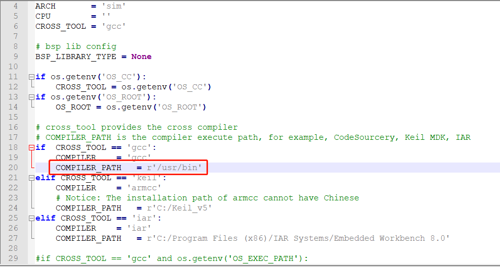
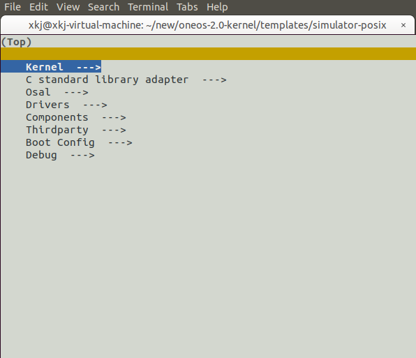
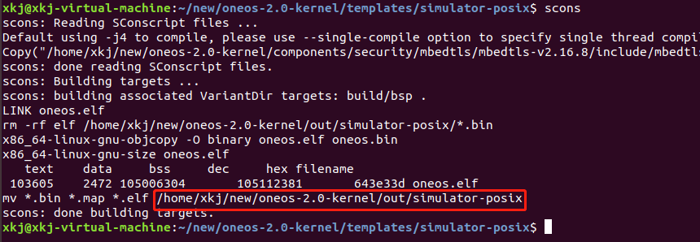
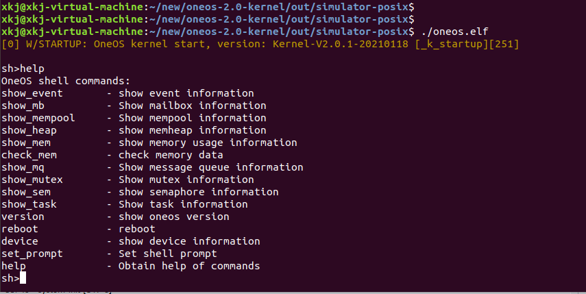

# 			OneOS-Linux-Simulator开发指南

## 概述

本文档将以ubuntu命令行环境为示例说明linux下如何搭建OneOS-Linux-Simulator的开发环境，其他linux变体操作系统的操作基本思路是一样的，只需要适当调整安装软件的方法即可。

## 1 环境准备

### 1.1 安装scons环境

`sudo apt-get install scons`

通过下面命令查看scons版本信息，确认安装是否能正常启动

`scons -v`

### 1.2 下载源码

### 1.3 配置编译器
1.进入源码中的工程目录（templates/simulator-posix）,编辑osconfig.py指定编译器路径环境变量(一般编译器路径为/usr/bin),具体修改入下图红框中：
     

##2 配置工程

1.进入源码中的工程目录（templates/simulator-posix）下直接输入命令：

`scons --menuconfig`

即可弹出操作系统配置菜单。用户根据自己的需要配置即可。操作方法与linux传统的menuconfig是一致的。如下图：

## 3 编译

进入源码中的工程目录（templates/simulator-posix）下直接输入命令：

`scons`

即可开始编译流程。生成镜像默认位于源码顶层目录out目录中，也会在编译结束时打印路径，如下图所示：

## 4 运行

进入镜像目录（out/simulator-posix）下直接输入命令：

`./oneos.elf`

即可运行，成功运行的OneOS如下图所示：

