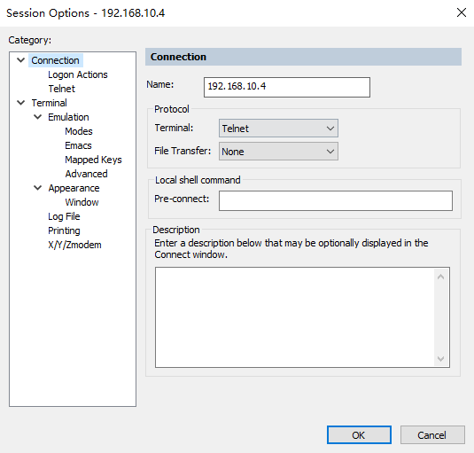

# Telnet简介


## 功能

Telnet是远程登陆服务的标准协议之一，属于TCP/IP协议族成员。它为用户提供在本地计算机上完成远程主机工作的能力，终端使用者可以在telnet程序中输入命令，这些命令会在服务器上运行，实现本地控制远程服务器的目的。

Telnet包括server和clinet两个角色，OneOS目前支持的是Telnet server端，以单独工具形式存在于thirthparty。当Telnet server开启后，client可以连接到开发板shell，实现shell命令的远程发送。

本工具移植于使用GPLv3的GNU inetutils 1.9.4，兼容于Apache 2.0。


## 代码结构

| 目录    | 说明                                          |
| ------- | --------------------------------------------- |
| doc  | 工具说明文档 |
| inc  | telnet头文件 |
| src   | telnet源码                                      |
| Kconfig     | 配置文档                                      |
| SConscript | 编译脚本                      |


## 实现流程


## 配置

通过Menuconfig的图形化工具进行配置选择是否打开telnet server功能，配置的路径如下所示：

```
(Top) → Thirdparty→ telnetd
                                                                  OneOS Configuration
[*] enable telnet server (NEW)
```
PS.若flash空间不足，可以关闭不用的功能，如dirver中的audio, graphic。

## 函数列表


| **函数**                                             | **说明**                     |
| :--------------------------------------------------- | :--------------------------- |
| telnetd                                      | telnet服务启动入口，shell通过此函数触发                   |
| telnetd_main                                     | telnet主线程，等待客户端连接                 |
| telnetd_run                                    | telnet连接后处理函数                 |


## 使用方法

### 启动服务

确认开发板已经连接到网络，可以通过ifconfig命令获取当前IP确认。

```
sh />lwip_ifconfig
network interface: e0 (Default)
MTU: 1500
MAC: 00 04 a3 12 34 56 
FLAGS: UP LINK_UP ETHARP BROADCAST IGMP
ip address: 192.168.10.4
gw address: 192.168.10.1
net mask  : 255.255.255.0
dns server #0: 192.168.10.1
dns server #1: 0.0.0.0
sh />
```

网络连接成功后，在shell窗口输入telnetd启动服务

```
sh />telnetd
[telnetd] start
[telnetd] io_setup
[telnetd] waiting connection 
sh />
```

### 远程登陆

远程PC使用telnet工具连接开发板，以SecureCRT为例：




开发板显示连接信息：

```
sh />[telnetd] connected to (192.168.10.6:39108)
```

可以在SecureCRT执行shell命令


### 注意事项

1.已测试工程：oneos2.0分支stm32l475-atk-pandora，主机和开发板通过局域网连接。

2.目前telnet登陆不支持验证用户名密码，打开服务后直接连接即可。

3.telnet登陆成功后，原uart端口无法使用。

4.telnet 输出buffer限制1024字节，例如help信息超过后可能不能全部显示完整。